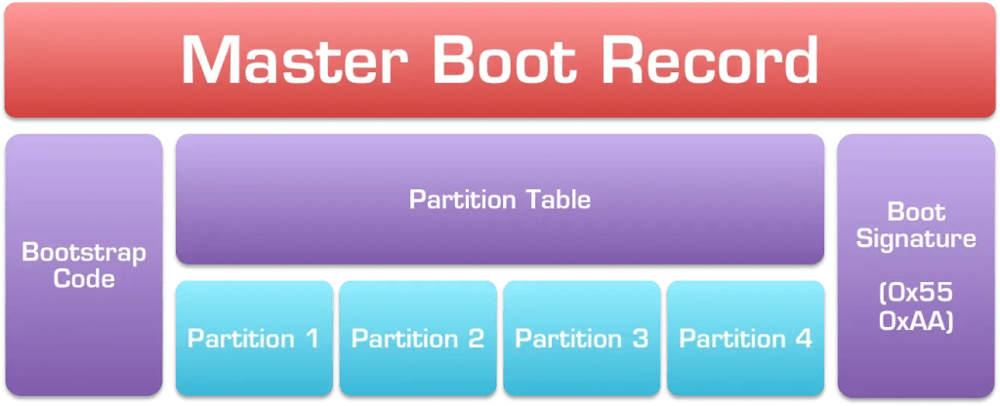
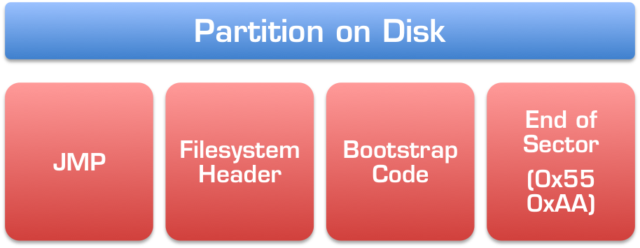
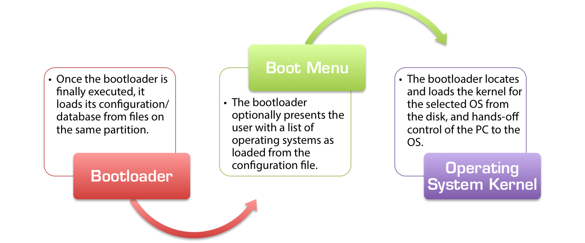
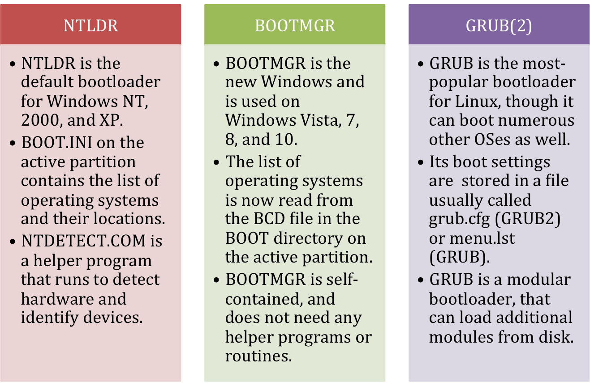

Independentemente do computador ou sistema operacional, desktops e laptops padrão ("compatíveis com IBM") são ligados e inicializados usando uma de duas maneiras: o método BIOS-MBR tradicional e o método UEFI-GPT mais recente, usado pelos mais recentes versões do Windows, Linux e Mac OS X em PCs, laptops e tablets mais recentes. Este artigo resume o processo pelo qual os PCs BIOS tradicionais carregam um sistema operacional, cobrindo os fundamentos e detalhes do BIOS, MBR e setor de inicialização.

### Visão geral do processo de inicialização do BIOS / MBR
No diagrama abaixo, a sequência de inicialização para todos os computadores e sistemas operacionais padrão é mostrada:

Como você pode ver, o processo de inicialização é dividido em vários componentes principais, cada um dos quais é um subsistema completamente separado com muitas opções e variações diferentes. As implementações de cada componente podem diferir muito dependendo do seu hardware e sistema operacional, mas as regras que eles seguem e o processo pelo qual funcionam são sempre os mesmos.

## Componentes do processo de inicialização
### O BIOS
O BIOS é onde o hardware encontra o software pela primeira vez e onde começa toda a mágica do boot. O  código BIOS é embutido na placa-mãe do seu PC, geralmente armazenado no que é chamado de EEPROM  1 e é consideravelmente específico do hardware. O BIOS é o software de nível mais baixo que faz interface com o hardware como um todo, 2 e é a interface por meio da qual o carregador de inicialização e o kernel do sistema operacional podem se comunicar e controlar o hardware. Por meio de chamadas padronizadas para o BIOS (“interrupções” no jargão de computador), o sistema operacional pode acionar o BIOS para ler e gravar no disco e fazer interface com outros componentes de hardware.

Quando o seu PC é ligado pela primeira vez, muita coisa acontece. Os componentes elétricos do PC são inicialmente responsáveis ​​por dar vida ao seu computador, pois os circuitos de neutralização levam o toque do botão liga / desliga e acionam um interruptor que ativa a fonte de alimentação e direciona a corrente da fonte de alimentação para a placa-mãe e, principalmente através dela, para todos os vários componentes do seu PC. À medida que cada componente individual recebe eletricidade vital, ele é ligado e colocado online em seu estado inicial. As rotinas de inicialização e a funcionalidade geral dos componentes mais simples, como RAM e PSU, estão embutidos neles como uma série de circuitos lógicos (portas AND / NAND e OR / NOR), enquanto as partes mais complicadas, como a placa de vídeo, têm seus próprios microcontroladores que atuam como mini-CPUs,controlar o hardware e interagir com o resto do seu PC para delegar e supervisionar o trabalho.

### O Processo POST
Uma vez que seu PC tenha sido ligado, o BIOS começa seu trabalho como parte do processo POST (Power-On Self Test). Ele une todas as várias partes do seu PC e faz a interface entre elas conforme necessário, configurando seu monitor de vídeo para aceitar VGA básico e exibi-lo na tela, inicializando os bancos de memória e dando à CPU acesso a todo o hardware. Ele verifica os barramentos IO em busca de hardware conectado e identifica e mapeia o acesso aos discos rígidos que você conectou ao PC. O BIOS em placas-mãe mais novas é inteligente o suficiente para até mesmo reconhecer e identificar dispositivos USB, como unidades externas e mouses USB, permitindo que você inicialize a partir de dispositivos USB e use o mouse em software legado.

Durante o procedimento POST, testes rápidos são realizados sempre que possível e erros causados ​​por hardware incompatível, dispositivos desconectados ou componentes com falha são freqüentemente detectados.  É a BIOS responsável por uma variedade de mensagens de erro, como “erro de teclado ou nenhum teclado presente ”ou avisos sobre memória incompatível / não reconhecida. Neste ponto, a maior parte do trabalho do BIOS foi concluída e está quase pronto para passar para o próximo estágio do processo de inicialização. A única coisa que resta é executar o que é chamado de “Add-On ROMs”: algum hardware conectado à placa-mãe pode exigir a intervenção do usuário para completar sua inicialização e o BIOS realmente entrega o controle de todo o PC para rotinas de software codificadas em hardware como o placa de vídeo ou controladores RAID. Eles assumem o controle do computador e de sua tela e permitem que você faça coisas como configurar matrizes RAID ou definir as configurações de tela antes mesmo que o PC tenha realmente terminado de ligar. Quando terminam a execução, eles passam o controle do computador de volta para o BIOS e o PC entra em um estado básico e utilizável e está pronto para começar.

### BIOS Boot Handoff
Depois de configurar os dispositivos básicos de entrada e saída do seu PC, o BIOS agora entra nos estágios finais onde ainda está no controle do seu computador. Neste ponto, você normalmente terá a opção de apertar rapidamente uma tecla para entrar na configuração do BIOS, de onde você pode definir as configurações de hardware e controlar como o seu PC é inicializado. Se você não escolher nada, o BIOS iniciará a primeira etapa para realmente “inicializar” o seu PC usando as configurações padrão.

Anteriormente, mencionamos que uma parte importante do trabalho do BIOS é detectar e mapear os discos rígidos conectados. Esta lista agora é útil, pois a BIOS carregará um programa muito pequeno do primeiro disco rígido para a memória e dirá à CPU para executar seu conteúdo, transferindo o controle do computador para o que quer que esteja no disco rígido e encerrando sua atividade papel no carregamento de seu PC. Este disco rígido é conhecido como “dispositivo de inicialização”, “disco de inicialização” ou “unidade 0” e geralmente pode ser selecionado ou definido na configuração do BIOS.

### O dispositivo de inicialização
Independentemente de o BIOS ter sido configurado para inicializar a partir de um disco rígido local ou de um stick USB removível, a sequência de transferência é a mesma. Uma vez que os procedimentos do BIOS POST e AddOn ROM foram concluídos, o BIOS carrega os primeiros 512 bytes do disco rígido do dispositivo de inicialização selecionado - esses 512 bytes são comumente conhecidos como MBR ou Master Boot Record.

### O Master Boot Record (MBR)
O MBR é o primeiro e mais importante componente do lado do software no procedimento de inicialização em máquinas baseadas em BIOS. Cada disco rígido possui um MBR e contém várias informações importantes.

### A Tabela de Partição
Em primeiro lugar, o MBR contém algo chamado tabela de partição, que é um índice de até quatro partições que existem no mesmo disco, um índice, se preferir. Sem ele (como em disquetes), o disco inteiro poderia conter apenas uma partição, o que significa que você não pode ter coisas como sistemas de arquivos diferentes na mesma unidade, o que por sua vez significaria que você nunca poderia instalar Linux e Windows no mesmo disco, por exemplo.

### Código Bootstrap
Em segundo lugar, o MBR também contém um código muito importante conhecido como "código de bootstrap". Os primeiros 440 3  desses 512 bytes podem conter literalmente qualquer coisa - o BIOS irá carregá-lo e executar seu conteúdo como está, dando início ao procedimento de bootloader. 440 bytes é incrivelmente pequeno. Quão pequeno? Bem, para colocar as coisas em contexto, 440 bytes é apenas 0,3% da capacidade de um antigo disquete de 1,44 MiB - apenas o suficiente para caber em qualquer forma de código útil - e muito, muito pequeno para fazer algo tão complicado como chamar o kernel do sistema operacional do disco.

Dado o quão pequena é a seção do código de bootstrap do MBR, o único propósito útil que ela pode realmente servir é procurar outro arquivo do disco e carregá-lo para realizar o processo de inicialização real. Como tal, este código de bootstrap é frequentemente denominado um "bootloader de estágio um". Dependendo do sistema operacional, o local exato em que o código de bootstrap procura o “bootloader de estágio 2” pode mudar, mas no Windows o bootloader de estágio 1 irá procurar na tabela de partição do MBR por uma partição marcada como “ativa” que é MBR- fale para “inicializável”, indicando que o início da partição contém a próxima parte do código de inicialização em seus setores iniciais (também conhecido como seu “setor de inicialização”). Em um disco MBR criado corretamente, apenas uma partição pode ser marcada como ativa por vez. 4

Portanto, o trabalho do segmento de código de bootstrap no MBR é bastante simples: procure a partição ativa na tabela de partição e carregue esse código na memória para execução pela CPU como o próximo link na cadeia de boot. Dependendo do sistema operacional que você está carregando, ele pode realmente procurar uma partição codificada em vez da partição ativa (por exemplo, sempre carregue o setor de inicialização da 3ª partição) e o deslocamento do código de inicialização dentro do setor de inicialização da partição pode mudar (por exemplo em vez de ser os primeiros 2 KiB da partição, pode ser o segundo KiB ou 6 KiB a partir do 2º múltiplo da fase atual da lua) - mas o conceito básico permanece o mesmo. No entanto, por motivos de compatibilidade de legado, o MBR quase sempre carrega o primeiro setor da partição ativa, ou seja, outros apenas 512 bytes.

### Assinatura de inicialização
Em PCs compatíveis com IBM (basicamente, tudo) os dois bytes finais do MBR de 512 bytes são chamados de  assinatura de inicialização e são usados ​​pelo BIOS para determinar se a unidade de inicialização selecionada é realmente inicializável ou não. Em um disco que contém um código de bootstrap válido, os dois últimos bytes do MBR devem ser sempre 0x55 0xAA. 5 Se os dois últimos bytes do MBR não forem iguais a 0x55 e 0xAA respectivamente, o BIOS irá assumir que o disco não é inicializável e não é uma opção de inicialização válida - neste caso, ele voltará para o próximo dispositivo na lista de ordem de inicialização (conforme configurado na configuração do BIOS). Por exemplo, se o primeiro dispositivo de inicialização no BIOS for definido como o stick USB e o segundo for o disco rígido local, se um stick USB sem a assinatura de inicialização correta estiver conectado, o BIOS irá ignorá-lo e tentar carregar do disco local. Se nenhum disco na lista de dispositivos de inicialização tiver a assinatura de inicialização 0x55 0xAA correta, o BIOS exibirá um erro como o infame “Nenhum dispositivo de inicialização disponível” ou “Reinicialize e selecione o dispositivo de inicialização adequado”.

### O setor de inicialização da partição
Conforme abordado acima, o código de bootstrap no MBR geralmente carregará uma sequência de bytes a partir do início da partição ativa. O layout exato de uma partição depende de qual sistema de arquivos a partição foi criada ou formatada, mas geralmente se parece com isto:

Novamente, dependendo do sistema operacional e do sistema de arquivos, o layout exato da partição certamente será diferente. Mas isso representa uma boa aproximação do que você normalmente verá:

*. Uma única instrução JMP (salto), que é a montagem 6 equivalente a um  comando goto.
*. O cabeçalho do sistema de arquivos, que conterá informações específicas e importantes para o próprio sistema de arquivos.
*. Outro segmento de código de bootstrap, contendo o próximo estágio do processo de bootloader.
*. Um marcador de fim de setor, muito semelhante à assinatura de inicialização 0x55 0xAA que vimos anteriormente no MBR.

Isso tudo é geralmente compactado no primeiro setor da partição, que normalmente tem apenas 512 bytes de comprimento e, novamente, não cabe muitos dados ou instruções. Em sistemas de arquivos modernos para sistemas operacionais mais recentes, o código de bootstrap pode aproveitar a funcionalidade aprimorada do BIOS para ler e executar mais do que apenas 512 bytes, mas em todos os casos, as etapas básicas permanecem as mesmas:

*. O MBR carrega os primeiros 512 bytes da partição ativa na memória e instrui a CPU a executá-los.
*. Os primeiros (três) bytes do setor de inicialização da partição contêm uma única instrução JMP, dizendo à CPU para pular xx bytes à frente e executar o próximo estágio do carregador de inicialização a partir daí.
*. A CPU segue a instrução JMP e busca o início do código de bootstrap contido no setor de inicialização da partição e começa a executar.

O código de bootstrap na partição não é o fim do caminho, é apenas mais uma etapa ao longo do caminho. Por causa de quão pouco espaço é alocado para o código de bootstrap no  setor de inicialização da partição, o código que ele contém normalmente termina com outro comando JMP instruindo a CPU a pular para o  próximo setor na partição, que muitas vezes é reservado para o restante da partição código. Dependendo do sistema de arquivos, pode ter vários setores de comprimento, ou o comprimento necessário para caber neste estágio do bootloader.

### O bootloader de segundo estágio
O segundo estágio do bootloader, armazenado no setor de inicialização da partição na seção de bootstrap e, opcionalmente, continuando além dele, executa a próxima etapa do processo de bootloader: ele procura um arquivo armazenado na própria partição (como um arquivo normal) , e diz à CPU para executar seu conteúdo para iniciar a parte final do processo de inicialização.

Ao contrário dos segmentos de bootstrap anteriores do MBR e do setor de boot da partição, a próxima etapa do processo de boot não é armazenada em um deslocamento dedicado dentro da partição (ou seja, o código de bootstrap não pode simplesmente dizer à CPU para JMP para a localização 0xABC e executar o arquivo de inicialização a partir daí) - é um arquivo normal armazenado entre outros arquivos normais no sistema de arquivos do disco.

Este código de bootstrap significativamente mais complicado deve realmente ler o índice do sistema de arquivos na partição, 7 O carregador de boot de segundo estágio de versões mais antigas de sistemas de arquivos muitas vezes impôs restrições complicadas aos arquivos do carregador de boot que eles precisavam carregar, como exigindo que eles apareçam nos primeiros kilobytes da partição ou sendo incapaz de carregar arquivos alocados de forma não contígua na partição. Este arquivo é a última peça do quebra-cabeça do bootloader e geralmente não há restrições quanto ao seu tamanho ou conteúdo, o que significa que pode ser tão grande e tão complicado quanto necessário para carregar o kernel do sistema operacional do disco e passar adiante controle do PC para o sistema operacional.

## O Bootloader
Os arquivos do carregador de inicialização reais no disco formam as partes finais do processo de carregamento de inicialização. Quando as pessoas falam sobre carregadores de inicialização e arquivos de inicialização, geralmente estão se referindo a esta etapa final e crítica do processo de inicialização.

Uma vez que o controle do PC foi transferido do BIOS para o código de bootstrap no MBR e do MBR para o código de bootstrap no setor de inicialização da partição, e daí para os arquivos de inicialização executáveis na partição ativa, a lógica real envolvido na determinação de qual sistema operacional carregar, de onde carregá-lo, quais parâmetros / opções transmitir a ele e concluir quaisquer interações com o usuário que possam estar disponíveis, o processo real de inicialização do sistema operacional começa.

### Arquivos de configuração de inicialização
Embora os arquivos executáveis do carregador de inicialização possam teoricamente conter informações codificadas pertencentes aos sistemas operacionais a serem carregados do disco, isso não seria muito útil. Como tal, quase todos os bootloaders separam o bootloader executável real do arquivo de configuração ou banco de dados que contém informações sobre o (s) sistema (s) operacional (is) a carregar. Todos os principais bootloaders mencionados abaixo têm suporte para carregar vários sistemas operacionais, um processo conhecido como “dual-boot” ou “multi-boot”.

### Carregadores de inicialização populares
Conforme discutido anteriormente, existem muitos bootloaders diferentes por aí. Cada sistema operacional tem seu próprio bootloader, projetado especificamente para ler seu sistema de arquivos e localizar o kernel que precisa ser carregado para que o SO funcione. Aqui estão alguns dos bootloaders mais populares - e seus arquivos de configuração essenciais - para alguns dos sistemas operacionais comuns:

Cada um dos sistemas operacionais populares tem seu próprio bootloader padrão. Windows NT, 2000 e XP, bem como Windows Server 2000 e Windows Server 2003, usam o carregador de inicialização NTLDR. O Windows Vista introduziu o bootloader BOOTMGR, atualmente usado pelo Windows Vista, 7, 8 e 10, bem como pelo Windows Server 2008 e 2012. Embora vários bootloaders diferentes tenham existido para o Linux ao longo dos anos, os dois bootloaders predominantes foram Lilo e GRUB, mas agora a maioria das distribuições Linux se uniram em torno do poderoso carregador de inicialização GRUB2.

#### NTLDR
NTLDR é o antigo carregador de inicialização do Windows, usado pela primeira vez no Windows NT (daí o “NT” em “NTLDR”, abreviação de “NT Loader”) e atualmente usado no Windows NT, Windows 2000, Windows XP e Windows Server 2003.

O NTLDR armazena sua configuração de inicialização em um arquivo simples baseado em texto denominado BOOT.INI, armazenado no diretório raiz da partição ativa (geralmente C: \ Boot.ini). Depois que o NTLDR é carregado e executado pelo bootloader de segundo estágio, ele executa um programa auxiliar denominado NTDETECT.COM que identifica o hardware e gera um índice de informações sobre o sistema. Mais informações sobre NTLDR, BOOT.INI e NTDETECT.COM podem ser encontradas nos artigos vinculados em nossa base de conhecimento.

#### BOOTMGR
BOOTMGR é a versão mais recente do bootloader usado pelo Microsoft Windows e foi introduzido pela primeira vez nas versões beta do Windows Vista (então Windows Codename Longhorn). Atualmente é usado no Windows Vista, Windows 7, Windows 8, Windows 8.1 e Windows 10, bem como no Windows Server 2008 e no Windows Server 2012.

O BOOTMGR marcou um afastamento significativo do NTLDR. É um bootloader independente com muito mais opções, especialmente projetado para ser compatível com as funcionalidades mais recentes em sistemas operacionais modernos e projetado com EFI e GPT em mente (embora apenas certas versões do BOOTMGR suportem o carregamento do Windows a partir de um disco GPT ou em um UEFI / Configuração EFI). Ao contrário do NTLDR, o BOOTMGR armazena sua configuração em um arquivo chamado BCD - abreviação de Boot Configuration Database. Ao contrário do BOOT.INI, o arquivo BCD é um banco de dados binário que não pode ser aberto e editado manualmente. 8 Em vez disso, ferramentas de linha de comando especificamente projetadas, como bcdedit.exe, e utilitários GUI mais fáceis de usar, como EasyBCD,  devem ser usados ​​para ler e modificar a lista de sistemas operacionais.

#### GRUB
GRUB foi o gerenciador de inicialização predominantemente usado para Linux na década de 1990 e início de 2000, projetado para carregar não apenas o Linux, mas qualquer sistema operacional que implementasse a especificação de inicialização múltipla aberta para seu kernel. O arquivo de configuração do GRUB contendo uma lista de sistemas operacionais formatada com espaço em branco era freqüentemente chamado de menu.lst ou grub.lst e encontrado no diretório / boot / ou / boot / grub /. Como esses valores podiam ser alterados pela recompilação do GRUB com diferentes opções, diferentes distribuições do Linux tinham esse arquivo localizado com nomes diferentes em diretórios diferentes.

#### GRUB 2
Embora o GRUB finalmente tenha vencido Lilo e eLilo, ele foi substituído pelo GRUB 2 por volta de 2002, e o antigo GRUB foi oficialmente renomeado como "GRUB herdado". Surpreendentemente, GRUB 2 agora é oficialmente chamado de GRUB, enquanto o antigo GRUB foi oficialmente relegado ao nome de “Legacy GRUB”, mas felizmente você encontrará a maioria dos recursos online referindo-se à encarnação mais recente do carregador de boot GRUB como GRUB 2.

GRUB 2 é um gerenciador de inicialização modular poderoso, mais parecido com um sistema operacional do que um gerenciador de inicialização. Ele pode carregar dezenas de sistemas operacionais diferentes e oferece suporte a plug-ins personalizados (“módulos”) para introduzir mais funcionalidade e suportar procedimentos de inicialização complexos.

O arquivo do carregador de inicialização real para GRUB 2 não é um arquivo chamado GRUB2, mas um arquivo geralmente chamado core.img . Ao contrário do Legacy GRUB, o arquivo de configuração do GRUB 2 é mais um script e menos um arquivo de configuração tradicional. O arquivo grub.cfg, normalmente localizado em /boot/grub/grub.cfg na partição de inicialização, é semelhante a scripts de shell e oferece suporte a conceitos avançados como funções. A funcionalidade principal do GRUB 2 é complementada com módulos, normalmente encontrados em um subdiretório do diretório /boot/grub/ .

