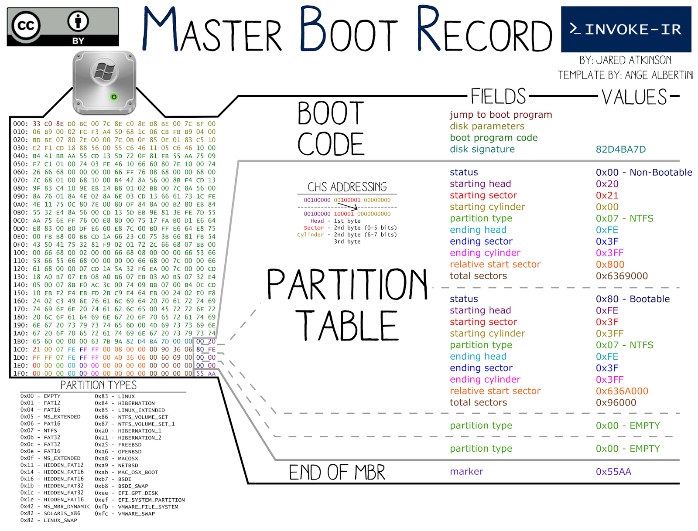
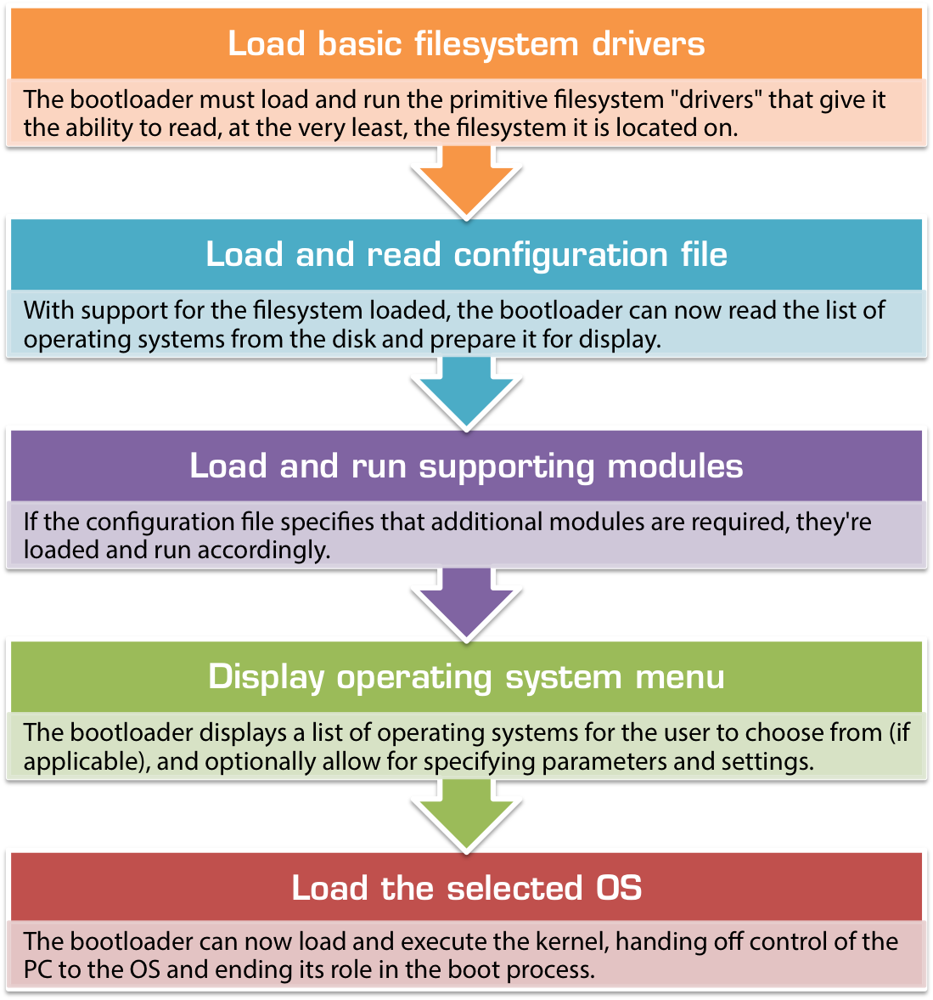

# BOOT no sistema BIOS e MBR

Independentemente do computador ou sistema operacional, desktops e laptops padrão ("compatíveis com IBM") são ligados e inicializados usando uma de duas maneiras: o método BIOS-MBR tradicional e o método UEFI-GPT mais recente, usado pelos mais recentes versões do Windows, Linux e Mac OS X em PCs, laptops e tablets mais recentes. Este artigo resume o processo pelo qual os PCs BIOS tradicionais carregam um sistema operacional, cobrindo os fundamentos e detalhes do BIOS, MBR e setor de inicialização.

### Visão geral do processo de inicialização do BIOS / MBR
No diagrama abaixo, a sequência de inicialização para todos os computadores e sistemas operacionais padrão é mostrada:

Como você pode ver, o processo de inicialização é dividido em vários componentes principais, cada um dos quais é um subsistema completamente separado com muitas opções e variações diferentes. As implementações de cada componente podem diferir muito dependendo do seu hardware e sistema operacional, mas as regras que eles seguem e o processo pelo qual funcionam são sempre os mesmos.

## Componentes do processo de inicialização
### O BIOS
O BIOS é onde o hardware encontra o software pela primeira vez e onde começa toda a mágica do boot. O  código BIOS é embutido na placa-mãe do seu PC, geralmente armazenado no que é chamado de EEPROM  1 e é consideravelmente específico do hardware. O BIOS é o software de nível mais baixo que faz interface com o hardware como um todo, 2 e é a interface por meio da qual o carregador de inicialização e o kernel do sistema operacional podem se comunicar e controlar o hardware. Por meio de chamadas padronizadas para o BIOS (“interrupções” no jargão de computador), o sistema operacional pode acionar o BIOS para ler e gravar no disco e fazer interface com outros componentes de hardware.

Quando o seu PC é ligado pela primeira vez, muita coisa acontece. Os componentes elétricos do PC são inicialmente responsáveis ​​por dar vida ao seu computador, pois os circuitos de neutralização levam o toque do botão liga / desliga e acionam um interruptor que ativa a fonte de alimentação e direciona a corrente da fonte de alimentação para a placa-mãe e, principalmente através dela, para todos os vários componentes do seu PC. À medida que cada componente individual recebe eletricidade vital, ele é ligado e colocado online em seu estado inicial. As rotinas de inicialização e a funcionalidade geral dos componentes mais simples, como RAM e PSU, estão embutidos neles como uma série de circuitos lógicos (portas AND / NAND e OR / NOR), enquanto as partes mais complicadas, como a placa de vídeo, têm seus próprios microcontroladores que atuam como mini-CPUs,controlar o hardware e interagir com o resto do seu PC para delegar e supervisionar o trabalho.

### O Processo POST
Uma vez que seu PC tenha sido ligado, o BIOS começa seu trabalho como parte do processo POST (Power-On Self Test). Ele une todas as várias partes do seu PC e faz a interface entre elas conforme necessário, configurando seu monitor de vídeo para aceitar VGA básico e exibi-lo na tela, inicializando os bancos de memória e dando à CPU acesso a todo o hardware. Ele verifica os barramentos IO em busca de hardware conectado e identifica e mapeia o acesso aos discos rígidos que você conectou ao PC. O BIOS em placas-mãe mais novas é inteligente o suficiente para até mesmo reconhecer e identificar dispositivos USB, como unidades externas e mouses USB, permitindo que você inicialize a partir de dispositivos USB e use o mouse em software legado.

Durante o procedimento POST, testes rápidos são realizados sempre que possível e erros causados ​​por hardware incompatível, dispositivos desconectados ou componentes com falha são freqüentemente detectados.  É a BIOS responsável por uma variedade de mensagens de erro, como “erro de teclado ou nenhum teclado presente ”ou avisos sobre memória incompatível / não reconhecida. Neste ponto, a maior parte do trabalho do BIOS foi concluída e está quase pronto para passar para o próximo estágio do processo de inicialização. A única coisa que resta é executar o que é chamado de “Add-On ROMs”: algum hardware conectado à placa-mãe pode exigir a intervenção do usuário para completar sua inicialização e o BIOS realmente entrega o controle de todo o PC para rotinas de software codificadas em hardware como o placa de vídeo ou controladores RAID. Eles assumem o controle do computador e de sua tela e permitem que você faça coisas como configurar matrizes RAID ou definir as configurações de tela antes mesmo que o PC tenha realmente terminado de ligar. Quando terminam a execução, eles passam o controle do computador de volta para o BIOS e o PC entra em um estado básico e utilizável e está pronto para começar.

### BIOS Boot Handoff
Depois de configurar os dispositivos básicos de entrada e saída do seu PC, o BIOS agora entra nos estágios finais onde ainda está no controle do seu computador. Neste ponto, você normalmente terá a opção de apertar rapidamente uma tecla para entrar na configuração do BIOS, de onde você pode definir as configurações de hardware e controlar como o seu PC é inicializado. Se você não escolher nada, o BIOS iniciará a primeira etapa para realmente “inicializar” o seu PC usando as configurações padrão.

Anteriormente, mencionamos que uma parte importante do trabalho do BIOS é detectar e mapear os discos rígidos conectados. Esta lista agora é útil, pois a BIOS carregará um programa muito pequeno do primeiro disco rígido para a memória e dirá à CPU para executar seu conteúdo, transferindo o controle do computador para o que quer que esteja no disco rígido e encerrando sua atividade papel no carregamento de seu PC. Este disco rígido é conhecido como “dispositivo de inicialização”, “disco de inicialização” ou “unidade 0” e geralmente pode ser selecionado ou definido na configuração do BIOS.

### O dispositivo de inicialização

|                    Endereço                   |     |                                         Descrição                                        |                       | Tamanho em bytes |
|:---------------------------------------------:|:---:|:----------------------------------------------------------------------------------------:|:---------------------:|:----------------:|
|                      Hex                      | Dec |                                                                                          |                       |                  |
|                      0000                     |  0  | Código de arranque do SO                                                                 |                       |  440 (max. 446)  |
|                      01B8                     | 440 | Assinatura opcional                                                                      |                       |         4        |
|                      01BC                     | 444 | normalmente nulo ; 0x0000                                                                |                       |         2        |
|                      01BE                     | 446 | Tabela de partições primarias (Quatro entradas de 16 bytes (IBM Partition Table scheme)) |                       |        64        |
|                      01FE                     | 510 |                                            55h                                           | MBR signature; 0x55AA |         2        |
|                      01FF                     | 511 |                                            AAh                                           |                       |                  |
| Tamanho total do MBR : 440 + 4 + 2 + 64 + 2 = |     |                                                                                          |                       |        512       |

Independentemente de o BIOS ter sido configurado para inicializar a partir de um disco rígido local ou de um stick USB removível, a sequência de transferência é a mesma. Uma vez que os procedimentos do BIOS POST e AddOn ROM foram concluídos, o BIOS carrega os **primeiros 512 bytes do disco rígido** do **dispositivo de inicialização selecionado** - esses **512 bytes** são comumente conhecidos como **MBR** ou **Master Boot Record**.

### O Master Boot Record (MBR - 512 bytes)

O **M.B.R.** é o primeiro e mais importante componente do lado do software no procedimento de inicialização em máquinas baseadas em BIOS. Cada disco rígido possui um MBR e contém várias informações importantes.

#### Visualizando o MBR do seu PC utilizando linux
Para poder ver uma foto equivalente a foto acima em seu editor de texto, considerando que seu PC use o padrão BIOS/MBR, faça o seguinte:
```bash
# descubra o tamanho do setor utilizado no disco
blockdev --getpbsz /dev/sda
512

# Neste disco o endereço LBA0 do disco correponde aos primeiros 512 bytes do disco

mkdir -p /tmp/1

# Usando a ferramenta dd
sudo dd if=/dev/sda of=/tmp/1/mbr_backup bs=512 count=1

# Usando a ferramenta dc3dd
sudo dc3dd if=/dev/sda of=/tmp/1/mbr_backup  cnt=1 ssz=512 hash=sha256 mlog=hashes

# Transformando o arquivo binário mbr_backup (de 512 bytes) em arquivo texto para poder abrir em um editor comum

hexdump -C mbr_backup > mbr_backup.txt

```
O resultado é este:
```hex
00000000  eb 63 90 10 8e d0 bc 00  b0 b8 00 00 8e d8 8e c0  |.c..............|
00000010  fb be 00 7c bf 00 06 b9  00 02 f3 a4 ea 21 06 00  |...|.........!..|
00000020  00 be be 07 38 04 75 0b  83 c6 10 81 fe fe 07 75  |....8.u........u|
00000030  f3 eb 16 b4 02 b0 01 bb  00 7c b2 80 8a 74 01 8b  |.........|...t..|
00000040  4c 02 cd 13 ea 00 7c 00  00 eb fe 00 00 00 00 00  |L.....|.........|
00000050  00 00 00 00 00 00 00 00  00 00 00 80 01 00 00 00  |................|
00000060  00 00 00 00 ff fa 90 90  f6 c2 80 74 05 f6 c2 70  |...........t...p|
00000070  74 02 b2 80 ea 79 7c 00  00 31 c0 8e d8 8e d0 bc  |t....y|..1......|
00000080  00 20 fb a0 64 7c 3c ff  74 02 88 c2 52 be 80 7d  |. ..d|<.t...R..}|
00000090  e8 17 01 be 05 7c b4 41  bb aa 55 cd 13 5a 52 72  |.....|.A..U..ZRr|
000000a0  3d 81 fb 55 aa 75 37 83  e1 01 74 32 31 c0 89 44  |=..U.u7...t21..D|
000000b0  04 40 88 44 ff 89 44 02  c7 04 10 00 66 8b 1e 5c  |.@.D..D.....f..\|
000000c0  7c 66 89 5c 08 66 8b 1e  60 7c 66 89 5c 0c c7 44  ||f.\.f..`|f.\..D|
000000d0  06 00 70 b4 42 cd 13 72  05 bb 00 70 eb 76 b4 08  |..p.B..r...p.v..|
000000e0  cd 13 73 0d 5a 84 d2 0f  83 d8 00 be 8b 7d e9 82  |..s.Z........}..|
000000f0  00 66 0f b6 c6 88 64 ff  40 66 89 44 04 0f b6 d1  |.f....d.@f.D....|
00000100  c1 e2 02 88 e8 88 f4 40  89 44 08 0f b6 c2 c0 e8  |.......@.D......|
00000110  02 66 89 04 66 a1 60 7c  66 09 c0 75 4e 66 a1 5c  |.f..f.`|f..uNf.\|
00000120  7c 66 31 d2 66 f7 34 88  d1 31 d2 66 f7 74 04 3b  ||f1.f.4..1.f.t.;|
00000130  44 08 7d 37 fe c1 88 c5  30 c0 c1 e8 02 08 c1 88  |D.}7....0.......|
00000140  d0 5a 88 c6 bb 00 70 8e  c3 31 db b8 01 02 cd 13  |.Z....p..1......|
00000150  72 1e 8c c3 60 1e b9 00  01 8e db 31 f6 bf 00 80  |r...`......1....|
00000160  8e c6 fc f3 a5 1f 61 ff  26 5a 7c be 86 7d eb 03  |......a.&Z|..}..|
00000170  be 95 7d e8 34 00 be 9a  7d e8 2e 00 cd 18 eb fe  |..}.4...}.......|
00000180  47 52 55 42 20 00 47 65  6f 6d 00 48 61 72 64 20  |GRUB .Geom.Hard |
00000190  44 69 73 6b 00 52 65 61  64 00 20 45 72 72 6f 72  |Disk.Read. Error|
000001a0  0d 0a 00 bb 01 00 b4 0e  cd 10 ac 3c 00 75 f4 c3  |...........<.u..|
000001b0  00 00 00 00 00 00 00 00  15 7e e8 48 00 00 80 20  |.........~.H... |
000001c0  21 00 83 fe ff ff 00 08  00 00 00 f8 4d 39 00 fe  |!...........M9..|
000001d0  ff ff 05 fe ff ff fe 07  4e 39 02 50 ea 00 00 00  |........N9.P....|
000001e0  00 00 00 00 00 00 00 00  00 00 00 00 00 00 00 00  |................|
000001f0  00 00 00 00 00 00 00 00  00 00 00 00 00 00 55 aa  |..............U.|
```

### A Tabela de Partição
Em primeiro lugar, o MBR contém algo chamado tabela de partição, que é um índice de até quatro partições que existem no mesmo disco, um índice, se preferir. Sem ele (como em disquetes), o disco inteiro poderia conter apenas uma partição, o que significa que você não pode ter coisas como sistemas de arquivos diferentes na mesma unidade, o que por sua vez significaria que você nunca poderia instalar Linux e Windows no mesmo disco, por exemplo.

### Código Bootstrap
Em segundo lugar, o MBR (512 bytes) também contém um código muito importante conhecido como **código de bootstrap**. 

> Dependendo do sistema operacional e da plataforma, o código de bootstrap pode realmente ter apenas **434** a **446** bytes, já que partes dessa região podem ser reservadas para outros fins, como a assinatura do disco e o carimbo de data / hora do disco. Na maioria dos sistemas operacionais modernos, **440** é o limite superior, pois os **últimos 6 bytes são reservados para a assinatura do disco de 4 bytes** no deslocamento **0x01B8** e um campo de **2 bytes indicando o estado de leitura e gravação da unidade** no deslocamento **0x01BC** (com **0x00 indicando leitura-gravação** e **0x5A5A indicando uma unidade somente leitura**).

Os **primeiros 440 bytes**  desses 512 bytes podem conter literalmente qualquer coisa - o BIOS irá carregá-lo e executar seu conteúdo como está, dando início ao procedimento de bootloader. 440 bytes é incrivelmente pequeno. Quão pequeno? Bem, para colocar as coisas em contexto, 440 bytes é apenas 0,3% da capacidade de um antigo disquete de 1,44 MiB - apenas o suficiente para caber em qualquer forma de código útil - e muito, muito pequeno para fazer algo tão complicado como chamar o kernel do sistema operacional do disco.

|     Sistema BIOS    |          Nomenclatura         |  Tamanho  |                                                                    Objetivo                                                                    |
|:-------------------:|:-----------------------------:|:---------:|:----------------------------------------------------------------------------------------------------------------------------------------------:|
|         MBR         |    Carregador Boot Primário   | 512 Bytes | Procure a partição ativa na tabela de partição e carregue esse código na memória para execução pela CPU como o próximo link na cadeia de boot. |
| GRUB2/BOOTMGR/NTLDR | Carregador de Boot Secundário |   Varia   |                                                                                                                                                |

Dado o quão pequena é a seção do código de bootstrap do MBR, o único propósito útil que ela pode realmente servir é procurar outro arquivo do disco e carregá-lo para realizar o processo de inicialização real. Como tal, este código de bootstrap é frequentemente denominado um "bootloader de estágio um". Dependendo do sistema operacional, o local exato em que o código de bootstrap procura o “bootloader de estágio 2” pode mudar, mas no Windows o bootloader de estágio 1 irá procurar na tabela de partição do MBR por uma partição marcada como “ativa” que é MBR- fale para “inicializável”, indicando que o início da partição contém a próxima parte do código de inicialização em seus setores iniciais (também conhecido como seu “setor de inicialização”). Em um disco MBR criado corretamente, apenas uma partição pode ser marcada como ativa por vez. 4

Portanto, o trabalho do segmento de código de bootstrap no MBR é bastante simples: procure a partição ativa na tabela de partição e carregue esse código na memória para execução pela CPU como o próximo link na cadeia de boot. Dependendo do sistema operacional que você está carregando, ele pode realmente procurar uma partição codificada em vez da partição ativa (por exemplo, sempre carregue o setor de inicialização da 3ª partição) e o deslocamento do código de inicialização dentro do setor de inicialização da partição pode mudar (por exemplo em vez de ser os primeiros 2 KiB da partição, pode ser o segundo KiB ou 6 KiB a partir do 2º múltiplo da fase atual da lua) - mas o conceito básico permanece o mesmo. No entanto, por motivos de compatibilidade de legado, o MBR quase sempre carrega o primeiro setor da partição ativa, ou seja, outros apenas 512 bytes.

### Assinatura de inicialização
Em PCs compatíveis com IBM (basicamente, tudo) os dois bytes finais do MBR de 512 bytes são chamados de  assinatura de inicialização e são usados ​​pelo BIOS para determinar se a unidade de inicialização selecionada é realmente inicializável ou não. Em um disco que contém um código de bootstrap válido, os dois últimos bytes do MBR devem ser sempre 0x55 0xAA. 5 Se os dois últimos bytes do MBR não forem iguais a 0x55 e 0xAA respectivamente, o BIOS irá assumir que o disco não é inicializável e não é uma opção de inicialização válida - neste caso, ele voltará para o próximo dispositivo na lista de ordem de inicialização (conforme configurado na configuração do BIOS). Por exemplo, se o primeiro dispositivo de inicialização no BIOS for definido como o stick USB e o segundo for o disco rígido local, se um stick USB sem a assinatura de inicialização correta estiver conectado, o BIOS irá ignorá-lo e tentar carregar do disco local. Se nenhum disco na lista de dispositivos de inicialização tiver a assinatura de inicialização 0x55 0xAA correta, o BIOS exibirá um erro como o infame “Nenhum dispositivo de inicialização disponível” ou “Reinicialize e selecione o dispositivo de inicialização adequado”.

### O setor de inicialização da partição
Conforme abordado acima, o código de bootstrap no MBR geralmente carregará uma sequência de bytes a partir do início da partição ativa. O layout exato de uma partição depende de qual sistema de arquivos a partição foi criada ou formatada, mas geralmente se parece com isto:

Novamente, dependendo do sistema operacional e do sistema de arquivos, o layout exato da partição certamente será diferente. Mas isso representa uma boa aproximação do que você normalmente verá:

*. Uma única instrução JMP (salto), que é a montagem 6 equivalente a um  comando goto.
*. O cabeçalho do sistema de arquivos, que conterá informações específicas e importantes para o próprio sistema de arquivos.
*. Outro segmento de código de bootstrap, contendo o próximo estágio do processo de bootloader.
*. Um marcador de fim de setor, muito semelhante à assinatura de inicialização 0x55 0xAA que vimos anteriormente no MBR.

Isso tudo é geralmente compactado no primeiro setor da partição, que normalmente tem apenas 512 bytes de comprimento e, novamente, não cabe muitos dados ou instruções. Em sistemas de arquivos modernos para sistemas operacionais mais recentes, o código de bootstrap pode aproveitar a funcionalidade aprimorada do BIOS para ler e executar mais do que apenas 512 bytes, mas em todos os casos, as etapas básicas permanecem as mesmas:

*. O MBR carrega os primeiros 512 bytes da partição ativa na memória e instrui a CPU a executá-los.
*. Os primeiros (três) bytes do setor de inicialização da partição contêm uma única instrução JMP, dizendo à CPU para pular xx bytes à frente e executar o próximo estágio do carregador de inicialização a partir daí.
*. A CPU segue a instrução JMP e busca o início do código de bootstrap contido no setor de inicialização da partição e começa a executar.

O código de bootstrap na partição não é o fim do caminho, é apenas mais uma etapa ao longo do caminho. Por causa de quão pouco espaço é alocado para o código de bootstrap no  setor de inicialização da partição, o código que ele contém normalmente termina com outro comando JMP instruindo a CPU a pular para o  próximo setor na partição, que muitas vezes é reservado para o restante da partição código. Dependendo do sistema de arquivos, pode ter vários setores de comprimento, ou o comprimento necessário para caber neste estágio do bootloader.

### O bootloader de segundo estágio
O segundo estágio do bootloader, armazenado no setor de inicialização da partição na seção de bootstrap e, opcionalmente, continuando além dele, executa a próxima etapa do processo de bootloader: ele procura um arquivo armazenado na própria partição (como um arquivo normal) , e diz à CPU para executar seu conteúdo para iniciar a parte final do processo de inicialização.

Ao contrário dos segmentos de bootstrap anteriores do MBR e do setor de boot da partição, a próxima etapa do processo de boot não é armazenada em um deslocamento dedicado dentro da partição (ou seja, o código de bootstrap não pode simplesmente dizer à CPU para JMP para a localização 0xABC e executar o arquivo de inicialização a partir daí) - é um arquivo normal armazenado entre outros arquivos normais no sistema de arquivos do disco.

Este código de bootstrap significativamente mais complicado deve realmente ler o índice do sistema de arquivos na partição.

> No NTFS, isso é chamado de tabela de arquivos mestre ou, abreviadamente, MFT. No FAT32, isso é chamado de FAT (tabela de alocação de arquivos).

O *carregador de boot de segundo estágio* de versões mais antigas de sistemas de arquivos muitas vezes impôs restrições complicadas aos arquivos do carregador de boot que eles precisavam carregar, como exigindo que eles apareçam nos primeiros kilobytes da partição ou sendo incapaz de carregar arquivos alocados de forma não contígua na partição. Este arquivo é a última peça do quebra-cabeça do bootloader e geralmente não há restrições quanto ao seu tamanho ou conteúdo, o que significa que pode ser tão grande e tão complicado quanto necessário para carregar o kernel do sistema operacional do disco e passar adiante controle do PC para o sistema operacional.


## O Bootloader
Os arquivos do carregador de inicialização reais no disco formam as partes finais do processo de carregamento de inicialização. Quando as pessoas falam sobre carregadores de inicialização e arquivos de inicialização, geralmente estão se referindo a esta etapa final e crítica do processo de inicialização.

Uma vez que o controle do PC foi transferido do BIOS para o código de bootstrap no MBR e do MBR para o código de bootstrap no setor de inicialização da partição, e daí para os arquivos de inicialização executáveis na partição ativa, a lógica real envolvido na determinação de qual sistema operacional carregar, de onde carregá-lo, quais parâmetros / opções transmitir a ele e concluir quaisquer interações com o usuário que possam estar disponíveis, o processo real de inicialização do sistema operacional começa.

### Arquivos de configuração de inicialização
Embora os arquivos executáveis do carregador de inicialização possam teoricamente conter informações codificadas pertencentes aos sistemas operacionais a serem carregados do disco, isso não seria muito útil. Como tal, quase todos os bootloaders separam o bootloader executável real do arquivo de configuração ou banco de dados que contém informações sobre o (s) sistema (s) operacional (is) a carregar. Todos os principais bootloaders mencionados abaixo têm suporte para carregar vários sistemas operacionais, um processo conhecido como “dual-boot” ou “multi-boot”.

### Carregadores de inicialização populares
Conforme discutido anteriormente, existem muitos bootloaders diferentes por aí. Cada sistema operacional tem seu próprio bootloader, projetado especificamente para ler seu sistema de arquivos e localizar o kernel que precisa ser carregado para que o SO funcione. Aqui estão alguns dos bootloaders mais populares - e seus arquivos de configuração essenciais - para alguns dos sistemas operacionais comuns:

Cada um dos sistemas operacionais populares tem seu próprio bootloader padrão. Windows NT, 2000 e XP, bem como Windows Server 2000 e Windows Server 2003, usam o carregador de inicialização NTLDR. O Windows Vista introduziu o bootloader BOOTMGR, atualmente usado pelo Windows Vista, 7, 8 e 10, bem como pelo Windows Server 2008 e 2012. Embora vários bootloaders diferentes tenham existido para o Linux ao longo dos anos, os dois bootloaders predominantes foram Lilo e GRUB, mas agora a maioria das distribuições Linux se uniram em torno do poderoso carregador de inicialização GRUB2.

#### NTLDR
NTLDR é o antigo carregador de inicialização do Windows, usado pela primeira vez no Windows NT (daí o “NT” em “NTLDR”, abreviação de “NT Loader”) e atualmente usado no Windows NT, Windows 2000, Windows XP e Windows Server 2003.

O NTLDR armazena sua configuração de inicialização em um arquivo simples baseado em texto denominado BOOT.INI, armazenado no diretório raiz da partição ativa (geralmente C: \ Boot.ini). Depois que o NTLDR é carregado e executado pelo bootloader de segundo estágio, ele executa um programa auxiliar denominado NTDETECT.COM que identifica o hardware e gera um índice de informações sobre o sistema. Mais informações sobre NTLDR, BOOT.INI e NTDETECT.COM podem ser encontradas nos artigos vinculados em nossa base de conhecimento.

#### BOOTMGR
BOOTMGR é a versão mais recente do bootloader usado pelo Microsoft Windows e foi introduzido pela primeira vez nas versões beta do Windows Vista (então Windows Codename Longhorn). Atualmente é usado no Windows Vista, Windows 7, Windows 8, Windows 8.1 e Windows 10, bem como no Windows Server 2008 e no Windows Server 2012.

O BOOTMGR marcou um afastamento significativo do NTLDR. É um bootloader independente com muito mais opções, especialmente projetado para ser compatível com as funcionalidades mais recentes em sistemas operacionais modernos e projetado com EFI e GPT em mente (embora apenas certas versões do BOOTMGR suportem o carregamento do Windows a partir de um disco GPT ou em um UEFI / Configuração EFI). Ao contrário do NTLDR, o BOOTMGR armazena sua configuração em um arquivo chamado BCD - abreviação de Boot Configuration Database. Ao contrário do BOOT.INI, o arquivo BCD é um banco de dados binário que não pode ser aberto e editado manualmente. 8 Em vez disso, ferramentas de linha de comando especificamente projetadas, como bcdedit.exe, e utilitários GUI mais fáceis de usar, como EasyBCD,  devem ser usados ​​para ler e modificar a lista de sistemas operacionais.

#### GRUB
GRUB foi o gerenciador de inicialização predominantemente usado para Linux na década de 1990 e início de 2000, projetado para carregar não apenas o Linux, mas qualquer sistema operacional que implementasse a especificação de inicialização múltipla aberta para seu kernel. O arquivo de configuração do GRUB contendo uma lista de sistemas operacionais formatada com espaço em branco era freqüentemente chamado de menu.lst ou grub.lst e encontrado no diretório / boot / ou / boot / grub /. Como esses valores podiam ser alterados pela recompilação do GRUB com diferentes opções, diferentes distribuições do Linux tinham esse arquivo localizado com nomes diferentes em diretórios diferentes.

#### GRUB 2
Embora o GRUB finalmente tenha vencido Lilo e eLilo, ele foi substituído pelo GRUB 2 por volta de 2002, e o antigo GRUB foi oficialmente renomeado como "GRUB herdado". Surpreendentemente, GRUB 2 agora é oficialmente chamado de GRUB, enquanto o antigo GRUB foi oficialmente relegado ao nome de “Legacy GRUB”, mas felizmente você encontrará a maioria dos recursos online referindo-se à encarnação mais recente do carregador de boot GRUB como GRUB 2.

GRUB 2 é um gerenciador de inicialização modular poderoso, mais parecido com um sistema operacional do que um gerenciador de inicialização. Ele pode carregar dezenas de sistemas operacionais diferentes e oferece suporte a plug-ins personalizados (“módulos”) para introduzir mais funcionalidade e suportar procedimentos de inicialização complexos.

O arquivo do carregador de inicialização real para GRUB 2 não é um arquivo chamado GRUB2, mas um arquivo geralmente chamado core.img . Ao contrário do Legacy GRUB, o arquivo de configuração do GRUB 2 é mais um script e menos um arquivo de configuração tradicional. O arquivo grub.cfg, normalmente localizado em /boot/grub/grub.cfg na partição de inicialização, é semelhante a scripts de shell e oferece suporte a conceitos avançados como funções. A funcionalidade principal do GRUB 2 é complementada com módulos, normalmente encontrados em um subdiretório do diretório /boot/grub/ .

## O processo de inicialização
Como mencionado anteriormente, o estágio do processo de inicialização é um pouco mais complicado do que as etapas anteriores, principalmente devido à complexidade adicional de leitura do sistema de arquivos. O bootloader também deve obter informações sobre o hardware da máquina subjacente (por meio do BIOS ou por conta própria) para carregar corretamente o sistema operacional desejado da partição correta e fornecer quaisquer arquivos ou dados adicionais que possam ser necessários. Ele também deve ler seu próprio arquivo de configuração a partir de um arquivo regular armazenado no sistema de arquivos da partição de inicialização, portanto, ele precisa, no mínimo, ter suporte total de leitura para qualquer sistema de arquivos em que resida.


#### Iniciar acesso ao sistema de arquivos
Antes que qualquer coisa possa acontecer, quando o bootloader é executado pela primeira vez, ele deve carregar e executar os “drivers” primitivos do sistema de arquivos que lhe dão a capacidade de ler, no mínimo, o sistema de arquivos em que está localizado. Como ele não consegue ler o sistema de arquivos antes disso, por necessidade o código que fornece essa funcionalidade deve ser compilado no próprio arquivo do carregador de inicialização principal.

#### Carregar e ler arquivo (s) de configuração
Com suporte para o sistema de arquivos carregado, o carregador de inicialização agora pode ler a lista de sistemas operacionais do disco e, se houver vários sistemas operacionais especificados, prepará-la para exibição.
Carregar e executar módulos de suporte
Para bootloaders que não são totalmente autocontidos (como NTLDR e GRUB 2), o bootloader agora carrega quaisquer módulos de suporte ou programas auxiliares (como NTDETECT.COM) do disco. A lista de módulos a serem carregados pode ser especificada no arquivo de configuração que acabou de ser lido ou codificado / compilado no próprio bootloader. Normalmente, cada módulo será executado conforme é localizado e carregado do disco.

#### Exibir o menu de inicialização
Neste ponto, com todas as configurações relevantes em mãos, o carregador de inicialização pode exibir o que é comumente conhecido como menu de inicialização na tela. Se vários sistemas operacionais estiverem instalados, é por meio do menu de inicialização que o usuário do computador pode navegar por uma lista de sistemas operacionais e escolher qual carregar. A partir daqui, alguns gerenciadores de inicialização também possibilitam especificar opções de tempo de execução, como carregar ou não o sistema operacional selecionado no modo de segurança.

#### Carregar o kernel do sistema operacional
Uma vez que a seleção do usuário foi registrada, o bootloader segue para o último e último estágio do processo de boot. Dependendo do sistema operacional e do tipo de kernel, o bootloader carregará a imagem do kernel do caminho especificado no arquivo de configuração (com a ajuda de quaisquer submódulos, se necessário) na memória. Em seguida, ele instrui a CPU a fazer o JMP para um determinado local dentro do kernel recém-carregado e começar a executar a partir daí.

## Limites do MBR

|   Ano   |              Problema             |  Limite |                                                                                                                                                                                                                                                                                                                                                                          Descrição                                                                                                                                                                                                                                                                                                                                                                          |
|:-------:|:---------------------------------:|:-------:|:-----------------------------------------------------------------------------------------------------------------------------------------------------------------------------------------------------------------------------------------------------------------------------------------------------------------------------------------------------------------------------------------------------------------------------------------------------------------------------------------------------------------------------------------------------------------------------------------------------------------------------------------------------------------------------------------------------------------------------------------------------------:|
|   1983  |               INT 13              |  8,5 GB | No máximo 1024 cilindros (numerados de 0-1023), 256 cabeçotes (numerados de 0-255), 63 setores / trilha (numerados de 1-63) para uma capacidade total máxima de 8455716864 bytes (8,5 GB). Esta é uma limitação séria hoje.Isso significa que o DOS não pode usar os discos grandes atuais.                                                                                                                                                                                                                                                                                                                                                                                                                                                                 |
|         |              IDE ATA              |  137 GB | No máximo 65.536 cilindros (numerados 0-65.535), 16 cabeçotes (numerados 0-15), 255 setores / trilha (numerados 1-255), para uma capacidade total máxima de 267.386.880 setores (de 512 bytes cada), ou seja, 136.902.082.560 bytes (137 GB). Em setembro de 2001, surgiram os primeiros discos maiores do que este (160 GB Maxtor Diamondmax).                                                                                                                                                                                                                                                                                                                                                                                                             |
|   1994  |    Compatibilidade INT 13 - ATA   |  528 MB | Se os mesmos valores para c, h, s forem usados para a chamada BIOS Int 13 e para a E / S de disco IDE, então ambas as limitações se combinam e pode-se usar no máximo 1024 cilindros, 16 cabeçotes, 63 setores / trilha, para uma capacidade máxima total de 528482304 bytes (528 MB), o infame limite de 504 MiB para DOS com um BIOS antigo. Isso começou a ser um problema por volta de 1993, e as pessoas recorreram a todos os tipos de artifícios, tanto em hardware (LBA), em firmware (traduzindo BIOS) e em software (gerenciadores de disco). O conceito de "tradução" foi inventado (1994): um BIOS poderia usar uma geometria enquanto conversava com o drive, e outra geometria falsa enquanto conversava com o DOS, e traduzir entre as duas. |
| 04/1996 |           BIOS economico          |  2,1 GB | Alguns BIOS mais antigos alocam apenas 12 bits para o campo na RAM CMOS que fornece o número de cilindros. Consequentemente, esse número pode ser no máximo 4095, e apenas 4095 *16 *63 *512 = 2113413120 bytes estão acessíveis. O efeito de ter um disco maior seria um travamento no momento da inicialização. Isso tornou os discos com geometria 4092/16/63 bastante populares. E ainda hoje muitas unidades de disco grandes vêm com um jumper para fazê-las parecer 4092/16/63. Veja também over2gb.txt . Outros BIOS não travariam, mas apenas detectariam um disco muito menor, como 429 MB em vez de 2,5 GB.                                                                                                                                      |
|         |     Gambiarra de  BIOS Phoenix    |  3,2 GB | Havia um bug no firmware do BIOS do Phoenix 4.03 e 4.04 que fazia com que o sistema travasse na configuração do CMOS para unidades com capacidade acima de 3.277 MB. Veja over3gb.txt .                                                                                                                                                                                                                                                                                                                                                                                                                                                                                                                                                                     |
|   1997  |   Gambiarra de  BIOS Phoenix II   |  4,2 GB | A tradução simples do BIOS (ECHS = Extended CHS, às vezes chamado de `Large disk support 'ou apenas` Large') funciona repetidamente dobrando o número de cabeçotes e reduzindo pela metade o número de cilindros mostrado no DOS, até que o número de cilindros seja no máximo 1024. Agora o DOS e o Windows 95 não podem lidar com 256 cabeças, e no caso comum em que o disco relata 16 cabeças, isso significa que este mecanismo simples funciona apenas até 8192 *16 *63 *512 = 4227858432 bytes (com uma geometria falsa com 1024 cilindros, 128 cabeças , 63 setores / trilha). Observe que o ECHS não altera o número de setores por trilha, portanto, se não for 63, o limite será menor. Veja over4gb.txt .                                       |
|         |         Gambiarra  de BIOS        |  7,9 GB | BIOSes um pouco mais inteligentes evitam o problema anterior ajustando primeiro o número de cabeçotes para 15 (`ECHS revisado '), de modo que uma geometria falsa com 240 cabeçotes possa ser obtida, boa para 1024 *240 *63 *512 = 7927234560 bytes.                                                                                                                                                                                                                                                                                                                                                                                                                                                                                                       |
|         |    Gambiarra de BIOS eficiente    |  8,4 GB | Finalmente, se a BIOS fizer todo o possível para tornar esta tradução um sucesso, e usar 255 cabeças e 63 setores / trilha (`LBA assistido 'ou apenas` LBA'), pode chegar a 1024 *255 *63 *512 = 8422686720 bytes, um pouco menos que o limite anterior de 8,5 GB porque as geometrias com 256 cabeças devem ser evitadas. (Esta tradução usará para o número de cabeças o primeiro valor H na sequência 16, 32, 64, 128, 255 para a qual a capacidade total do disco se encaixa em 1024 *H *63 *512, e então calcula o número de cilindros C como capacidade total dividido por (H *63 *512).)                                                                                                                                                             |
|   1999  |          Discos avançados         | 33,8 GB | O próximo obstáculo vem com um tamanho acima de 33,8 GB. O problema é que com o padrão de 16 cabeças e 63 setores / trilha isso corresponde a um número de cilindros de mais de 65535, o que não cabe em um curto. Muitos BIOSes não conseguiam lidar com esses discos. (Veja, por exemplo, atualizações da Asus para novas imagens flash que funcionam.) Kernels Linux anteriores a 2.2.14 / 2.3.21 precisam de um patch. Consulte problemas IDE com discos de 34+ GB abaixo.                                                                                                                                                                                                                                                                              |
|   2001  | Endereçamento de 28 bits do ATA-5 |  137 GB | Como mencionado acima, o protocolo ATA antigo usa 16 + 4 + 8 = 28 bits para especificar o número do setor e, portanto, não pode endereçar mais de 2 ^ 28 setores. ATA-6 descreve uma extensão que permite o endereçamento de 2 ^ 48 setores, um milhão de vezes mais. Há suporte em kernels muito recentes.                                                                                                                                                                                                                                                                                                                                                                                                                                                 |
|  Atual  |      MBR partiçoes de 32 bits     |   2 TB  | Com números de setor de 32 bits, pode-se endereçar 2 TiB.   Muitos softwares terão que ser reescritos quando os discos ficarem maiores.                                                                                                                                                                                                                                                                                                                                                                                                                                                                                                                                                                                                                     |

## Conclusão
Assim termina a longa jornada que começa com o apertar de um botão e termina com o kernel de um sistema operacional carregado na memória e executado. O processo de bootloader é certamente muito mais nuançado e complicado do que a maioria imagina, e foi projetado e evoluído para funcionar de forma bastante padronizada em diferentes plataformas e em uma variedade de sistemas operacionais.

Os componentes individuais do bootloader são, em geral, autossuficientes e autocontidos. Eles podem ser trocados individualmente sem afetar o todo, o que significa que você pode adicionar discos e inicializar de diferentes dispositivos sem se preocupar em perturbar configurações e sistemas operacionais existentes. Isso também significa que, em vez de ter um único bit de hardware / software para configurar, configurar, manter e depurar, você fica com uma cadeia intrincada e muitas vezes muito frágil, com vários pontos suscetíveis a quebras e falhas. Quando funcionando corretamente, o processo de inicialização é uma máquina bem lubrificada, mas quando ocorre um desastre, pode ser um processo muito difícil de entender e depurar.


