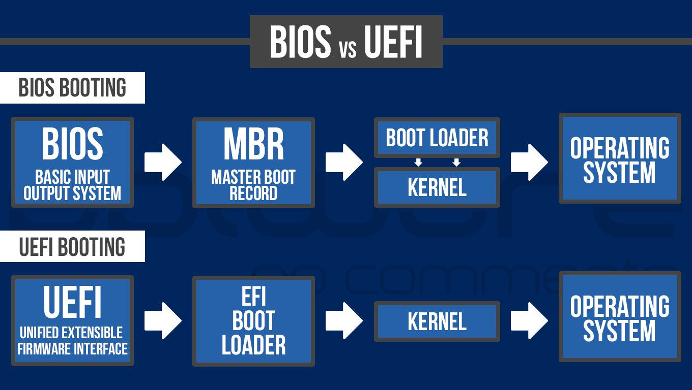

# BOOT em sistemas U.E.F.I.

O que eu mais quero falar é sobre o Carregamento de Boot (bootloading), porque essa é a parte do firmware que mais importa para a maioria das pessoas, e os sites de notícias estão sempre falando sobre isso.

### Terminologia

Primeiro, vamos nos alinhar um pouco da terminologia.  Tanto BIOS quanto UEFI são tipos
de [firmware](https://translate.google.com/website?sl=en&tl=pt&nui=1&u=http://en.wikipedia.org/wiki/Firmware) para computadores. 
| FIRMWARE |                                                              Apresentação na WikiPedia                                                             |
|:--------:|:--------------------------------------------------------------------------------------------------------------------------------------------------:|
|   BIOS   |           [Verbete sobre BIOS na wikipédia](https://translate.google.com/website?sl=en&tl=pt&nui=1&u=https://en.wikipedia.org/wiki/BIOS)           |
|   UEFI   | [Verbete sobre UEFI](https://translate.google.com/website?sl=en&tl=pt&nui=1&u=https://en.wikipedia.org/wiki/Unified_Extensible_Firmware_Interface) |

O firmware do tipo BIOS (principalmente) só é encontrado em [computadores compatíveis](https://translate.google.com/website?sl=en&tl=pt&nui=1&u=https://en.wikipedia.org/wiki/IBM_PC_compatible) com [IBM PC](https://translate.google.com/website?sl=en&tl=pt&nui=1&u=https://en.wikipedia.org/wiki/IBM_PC_compatible) . O UEFI pretende ser mais genérico e pode ser encontrado em sistemas que não estão na classe 'IBM PC compatível'.

Seria redundante você dizer que sua placa mãe possui 'UEFI BIOS'. O correto é dizer que o firmware de boot é 'UEFI'. Evite dizer 'UEFI BIOS'. BIOS não é um termo genérico para todo firmware de PC, é um tipo particular de firmware de PC. A placa mãe de seu computador possui um firmware. Se for um computador **compatível com IBM PC**, é quase certo que seja um firmware **BIOS ou um firmware UEFI**. Se você estiver executando o [Coreboot](https://translate.google.com/website?sl=en&tl=pt&nui=1&u=http://www.coreboot.org) , parabéns, Sr./Sra. Exceção. Você pode estar orgulhoso de si mesmo.

#### SecureBoot ou Inicialização Segura: opcional. 
[A inicialização segura](https://translate.google.com/website?sl=en&tl=pt&nui=1&u=https://en.wikipedia.org/wiki/Unified_Extensible_Firmware_Interface%23Secure_boot) ou *secureboot* é a mesma coisa que UEFI ? **NÃO**. Evite usar esses termos alternadamente. A inicialização segura é um **elemento efetivamente opcional** único da especificação UEFI, que foi adicionado na versão 2.2 da especificação UEFI. Falaremos precisamente sobre o que é mais tarde, mas por enquanto, lembre-se de que não é a mesma coisa sobre UEFI. Você precisa entender o que é inicialização segura, o que é UEFI e de qual dos dois você está realmente falando em um determinado momento. Falaremos primeiro sobre UEFI e, em seguida, falaremos sobre Inicialização segura como uma 'extensão' para UEFI, porque basicamente é isso que é.

*Nota histórica de bônus* : a UEFI não foi inventada, não é controlada e nunca foi controlada pela Microsoft. Seu predecessor e base, EFI, foi desenvolvido e publicado pela Intel. A UEFI é gerenciada pelo [UEFI Forum](https://translate.google.com/website?sl=en&tl=pt&nui=1&u=http://uefi.org/) . A Microsoft é membro do fórum UEFI. Assim como a Red Hat, a Apple e quase todos os principais fabricantes de PC, Intel (obviamente), AMD e uma [lista de outras empresas e organizações de hardware, software e firmware principais e secundárias](https://translate.google.com/website?sl=en&tl=pt&nui=1&u=http://uefi.org/members) . É uma especificação de amplo consenso, com toda a confusão que isso acarreta, algumas das quais falaremos especificamente mais tarde. Não é o veículo do mal de nenhuma empresa.
### Endereçamento Lógico em discos rígidos - LBA
O endereçamento lógico passou por várias evoluções acompanhando a capacidade de armazenamento das várias evoluções do IBM-PC.

|      Padrão     | Tamanho do LBA | Contador de Cilindro | Contador de Cabeça | Contador de Setor | Tamanho Setor em Bytes | Capacidade do disco                    |
|:---------------:|:--------------:|:--------------------:|:------------------:|:-----------------:|------------------------|----------------------------------------|
| INT 13 Original |     24 bits    |        10 bits       |       8 bits       |       6 bits      |        disquete        |                                        |
|  INT 13 compat  |     24 bits    |        10 bits       |       4 bits       |       6 bits      |        512 bytes       | 2^10^x2^4^x2^6^x512 = 528,482304 MB    |
|    Bit Shift    |     28 bits    |  16 bits map 10 bits |  4 bits map 8 bits | 8 bits map 6 bits |        512 bytes       | 2^10^x2^8^x2^6^x512 = 8,589934592 GB   |
|  ATA-1 a ATA-5  |     28 bits    |        16 bits       |       4 bits       |       8 bits      |        512 bytes       | 2^16^x2^4^x2^8^x512 = 137,438953472 GB |
|      ATA-6      |     48 bits    |          N/A         |         N/A        |        N/A        |        512 bytes       | 2^48^x512 = 144,12 PB                  |
| EDD BIOS        |     64 bits    |          N/A         |         N/A        |        N/A        |        512 bytes       | 2^64^x512 = 9,44 ZB                    |


### Referências

Se você realmente deseja entender a UEFI, é uma boa ideia ler as especificações da UEFI. Você consegue fazer isso. É muito fácil. Você não precisa pagar nada a ninguém. Não vou dizer que a leitura será a mais divertida que você já teve, porque não será. Mas não será uma perda de tempo. Você pode encontrá-lo [aqui mesmo no site oficial da UEFI](https://translate.google.com/website?sl=en&tl=pt&nui=1&u=http://www.uefi.org/specs/download) . Você tem que verificar algumas caixas, mas não está entregando sua alma a Satanás, nem nada. Está bem. Enquanto escrevo isto, a versão atual da especificação é [2.4 Errata A](https://translate.google.com/website?sl=en&tl=pt&nui=1&u=http://www.uefi.org/sites/default/files/resources/2_4_Errata_A.pdf) , e essa é a versão para a qual este post foi escrito.

Não há especificação de BIOS. O BIOS é um padrão *de fato* - funciona da maneira que funcionava em PCs IBM reais, na década de 1980. Essa é uma das razões pelas quais a UEFI existe.

Agora, para manter as coisas simples, vamos considerar dois mundos. Um é o mundo dos computadores compatíveis com IBM PC - doravante referidos apenas como PCs - antes da existência de UEFI e GPT (passaremos a GPT). Este é o mundo com o qual muitos de vocês provavelmente estão familiarizados e podem entender muito bem. Vamos falar sobre como funciona a inicialização em PCs com firmware BIOS.

### Inicialização do BIOS

Na verdade, funciona de uma maneira muito simples. Em seu velho IBM-PC equipado com BIOS, você tem um ou mais discos que possuem um [MBR](https://translate.google.com/website?sl=en&tl=pt&nui=1&u=https://en.wikipedia.org/wiki/Master_boot_record) 

. O *M.B.R.* é outro padrão de fato; basicamente, o início do disco descreve as partições no disco em um formato específico e contém um 'carregador de boot', um pequeno pedaço de código que um firmware de BIOS sabe como executar, cujo trabalho é inicializar o funcionamento sistema (s). 
> Os bootloaders modernos freqüentemente são muito maiores do que podem estar contidos no espaço do MBR (512 bytes) e têm que usar um **design de vários estágios** onde o bit no MBR apenas sabe como carregar o próximo estágio de algum outro lugar, mas isso não é importante para nós agora.

Tudo o que o firmware do BIOS sabe, no contexto da inicialização do sistema, são os discos que o sistema contém. Você, o proprietário de um computador baseado em BIOS, pode entrar no firmware e dizer para ele de qual disco você deseja inicializar ("bootar") o sistema. O firmware não tem conhecimento de nada além disso. Ele executa o bootloader que encontra no MBR do disco especificado e pronto: o firmware não está mais envolvido na inicialização.

No mundo da BIOS, absolutamente: 
* **todas as formas de inicialização múltipla são tratadas acima da camada de firmware**.

A camada de firmware BIOS:

* **não sabe** realmente o que é um **bootloader**.
* **não sabe** o que é um **sistema operacional**.
* **não sabe** o que é uma **partição**.

Tudo o que ele pode fazer é:
| **executar o carregador de boot a partir do MBR de um disco**. |
|----------------------------------------------------------------|

Você também  **não pode configurar o processo de inicialização de fora do firmware**.

### Inicialização UEFI: cenário



OK, então temos nossa referência histórica do mundo BIOS. Agora vamos ver como a inicialização funciona em um sistema UEFI. Mesmo que você não entenda os detalhes desta postagem, saiba que **UEFI é uma abordagem completamente diferente**. Completamente e totalmente diferente de como funciona a inicialização do BIOS. Você não pode aplicar nenhum de seus conhecimentos de inicialização do BIOS à inicialização UEFI nativa. Você não pode fazer um pequeno ajuste em um sistema projetado para o mundo da inicialização do BIOS e aplicá-lo à inicialização UEFI *nativa* . Você precisa entender que é um mundo completamente diferente.

#### CSM - o modo de compatibilidade com o "mundo antigo"
Aqui está outra coisa importante para entender: muitos firmwares UEFI implementam algum tipo de *modo de compatibilidade* de *BIOS* , às vezes referido como **CSM**.

> Muitos firmwares UEFI podem inicializar um sistema exatamente como um firmware de BIOS faria - eles podem procurar um MBR em um disco e executar o carregador de boot desse MBR e deixar tudo subsequentemente para esse carregador de boot. 

As pessoas às vezes se referem *incorretamente* ao uso desse recurso como 'desabilitar UEFI', o que é *linguisticamente* absurdo. Você não pode 'desabilitar' o firmware do seu sistema. É apenas um termo estúpido. Não use, mas entenda o que as pessoas realmente querem dizer quando falam. Eles estão falando sobre o uso da capacidade de um firmware UEFI para inicializar o sistema 'estilo BIOS'em vez do estilo UEFI nativo.
Se você tiver um sistema baseado em UEFI cujo firmware tem o recurso de compatibilidade de BIOS, e você decidir usá-lo, e aplicar esta decisão de forma consistente, então no que diz respeito à inicialização, você pode fingir que seu sistema é baseado em BIOS, e apenas faça tudo da maneira que você fez com a inicialização no estilo BIOS.

##### Misturar instalações com modo de compatibilidade e sem modo de compatibilidade: não faça.
> Se você estiver usando a compatibilidade CSM em sistemas de multiplos sistemas operacionais, use o mesmo padrão para todos: ou todos entram em compatibilidade CSM (discos precisam estar formatadados em formato GPT ao invés de MBR) ou nenhum entra. Não misture. Ou é UEFI/CSM + disco formatado em MBR; ou é UEFI PURO + disco formatado em GPT.

#### Particionamento U.E.F.I. raíz
O vou descrever a inicialização UEFI *nativa* . 
Vamos assumir o uso de discos com uma tabela de partição [GPT](https://translate.google.com/website?sl=en&tl=pt&nui=1&u=https://en.wikipedia.org/wiki/GUID_Partition_Table) e [partições de sistema EFI](https://translate.google.com/website?sl=en&tl=pt&nui=1&u=https://en.wikipedia.org/wiki/EFI_System_partition) FAT32 . 
Dependendo de quão profundo você vai mergulhar nessas coisas, você *pode* descobrir que não é estritamente falando o caso que você *sempre* pode assumir que estará lidando com discos GPT e ESPs EFI FAT32 ao lidar com inicialização nativa UEFI, mas o A especificação UEFI está fortemente ligada aos discos GPT e EFI FAT32 ESPs, e é com isso que você lidará em 99% dos casos. A menos que você esteja lidando com Macs, e francamente, *dane-se os* Macs.

### Inicialização nativa UEFI: como realmente funciona - plano de fundo

OK, com isso resolvido, vamos ao que interessa. É assim que a inicialização UEFI nativa realmente funciona. Provavelmente é útil abordar isso com um pouco de experiência de alto nível.

A UEFI fornece *muito* mais infraestrutura no nível do firmware para lidar com a inicialização do sistema. Está longe de ser tão simples quanto o BIOS. Ao contrário do BIOS, a UEFI certamente entende, em vários graus, os conceitos de 'partições de disco' e 'bootloaders' e 'sistemas operacionais'.

Você pode olhar para o processo de inicialização do BIOS, e olhar para o processo UEFI, e ver como o processo UEFI estende vários bits para resolver problemas específicos.

A abordagem do BIOS / MBR para encontrar o bootloader é bastante complicada, quando você pensa sobre isso. É um 'molho especial': este pequeno espaço particular na frente do disco contém código mágico que realmente só faz muito sentido para o firmware do sistema e utilitários especiais para escrevê-lo. Existem vários problemas com essa abordagem.

-   É inconveniente de lidar - você precisa de utilitários especiais para escrever o MBR, e a única maneira de descobrir o que está em um é separar o conteúdo e examiná-lo.
-   Como observado acima, o MBR em si não é grande o suficiente para muitos gerenciadores de inicialização modernos. O que eles fazem é instalar uma pequena parte de si mesmos no MBR adequado, e o resto no espaço vazio do disco entre onde o MBR convencional termina e a primeira partição começa. Há um grande problema com isso (bem, todo o design é um grande problema, mas não importa), que é que não há uma convenção confiável para onde a primeira partição deve começar, então é difícil ter certeza de que haverá espaço suficiente . Uma coisa em que você geralmente pode confiar é que não haverá espaço *suficiente* para algumas configurações do gerenciador de inicialização.
-   O design não fornece nenhuma camada padronizada ou mecanismo para selecionar alvos de inicialização diferentes de discos ... mas as pessoas *querem* selecionar alvos de inicialização diferentes de discos. ou seja, eles querem ter várias 'coisas' inicializáveis ​​- geralmente sistemas operacionais - por disco. A única maneira de fazer isso, no mundo BIOS / MBR, é os bootloaders lidar com isso; mas não existe uma convenção amplamente aceita sobre a maneira certa de fazer isso. Existem muitas abordagens diferentes, nenhuma das quais é particularmente interoperável com qualquer uma das outras, nenhuma das quais é um padrão ou convenção amplamente aceita, e é muito difícil escrever ferramentas na camada de instalação do OS / OS que lida com inicialização múltipla de forma limpa. É apenas um design muito confuso.
-   O design não fornece uma maneira padrão de inicializar de nada, *exceto* discos. Não vamos realmente falar sobre isso neste artigo, mas esteja ciente de que é outra vantagem da inicialização UEFI: ela fornece uma maneira padrão de inicialização a partir, por exemplo, de um servidor remoto.
-   Não há mecanismo para níveis acima do firmware para configurar o comportamento de inicialização do firmware.

Então você pode imaginar os elfos UEFI sentados e considerando este problema, e chegando a uma solução. Em vez de o firmware saber apenas sobre os discos e um local 'mágico' por disco onde o código do bootloader pode residir, o UEFI tem muito mais infraestrutura na camada do firmware para lidar com o carregamento do boot. Vejamos todas as coisas que ele define que são relevantes aqui.

### Executáveis ​​EFI

A especificação UEFI define um formato executável e requer que todos os firmwares UEFI sejam capazes de executar código neste formato. Ao escrever um carregador de inicialização para UEFI nativa, você escreve neste formato. Isso é muito simples e direto e não precisa de nenhuma explicação adicional: é apenas uma boa coisa que agora temos uma especificação de firmware que define um formato comum para o código que o firmware pode executar.

### O formato GPT (tabela de partição GUID)


O formato da [tabela de partição GUID](https://translate.google.com/website?sl=en&tl=pt&nui=1&u=https://en.wikipedia.org/wiki/GUID_Partition_Table) está muito vinculado à especificação UEFI e, novamente, isso não é algo particularmente complexo ou que precise de muitas explicações, é apenas um bom trabalho de base que a especificação fornece. GPT é apenas um padrão para fazer tabelas de partição - as informações no início de um disco que definem quais partições esse disco contém. É um padrão melhor para fazer isso do que as tabelas de partição MBR / 'MS-DOS' em muitos aspectos, e a especificação UEFI requer que firmwares compatíveis com UEFI sejam capazes de interpretar GPT (também requer que sejam capazes de interpretar MBR, para compatibilidade com versões anteriores). Tudo isso é uma base útil: o que está acontecendo aqui é que a especificação está estabelecendo certos recursos que tudo acima da camada de firmware pode contar com o firmware para ter.

### Partições do sistema EFI
> exemplo de um disco particionado em esquema GPT para trabalhar com um Firmware U.E.F.I. onde foi instalado o MS-Windows 10 e um Linux. Aqui, a máquina foi inicilizada no linux com a ferramenta gparted carregada, analisando o disco identificado por /dev/sdb, onde as 2 primeiras partições são reservadas ado MS-Windows, a terceira partição chamada de ESP é reservada a um sistema UEFI, e a quarta partição foi destinada ao linux.  


Na verdade, eu realmente envolvi minha cabeça em torno do conceito de partição do sistema EFI enquanto revisava este post, e foi um ótimo 'aha!' momento. Na verdade, o conceito de 'partições do sistema EFI' é apenas uma resposta ao problema do espaço MBR do 'molho especial'. O conceito de alguma quantidade indefinida de espaço vazio no início de um disco sendo 'onde o código do bootloader reside' é um design muito ruim, como vimos acima. As partições do sistema EFI são apenas a solução da UEFI para isso. [1](https://www-happyassassin-net.translate.goog/posts/2014/01/25/uefi-boot-how-does-that-actually-work-then/?_x_tr_sl=en&_x_tr_tl=pt&_x_tr_hl=pt-BR&_x_tr_pto=nui#fn:2)
>Esta seção inteira é uma simplificação - realmente, ao inicializar sistemas operacionais permanentemente instalados, o firmware não se importa se o bootloader está em um 'ESP' ou não; ele apenas lê a entrada do gerenciador de inicialização e tenta acessar a partição especificada e executar o executável especificado, como pjones explica aqui . Mas é convencional usar um ESP para esse propósito, já que é necessário existir de qualquer maneira, e é uma partição prática formatada com o sistema de arquivos que o firmware é capaz de ler. Tecnicamente falando, um 'ESP' é apenas um 'ESP' quando o firmware está fazendo uma inicialização de mídia removível / caminho de fallback.
A solução é esta: exigimos que a camada de firmware seja capaz de ler alguns tipos específicos de sistema de arquivos. A especificação UEFI requer que firmwares compatíveis sejam capazes de ler as variantes FAT12, FAT16 e FAT32 do formato [FAT](https://translate.google.com/website?sl=en&tl=pt&nui=1&u=https://en.wikipedia.org/wiki/File_Allocation_Table) , em essência. Na verdade, o que ele faz é codificar uma interpretação particular desses formatos como eles existiam no ponto em que a UEFI foi aceita e dizer que os firmwares compatíveis com UEFI devem ser capazes de ler esses formatos. Como diz a especificação:

"O sistema de arquivos suportado pela Extensible Firmware Interface é baseado no sistema de arquivos FAT. EFI define uma versão específica de FAT que é explicitamente documentada e testável. A conformidade com a especificação EFI e seus documentos de referência associados é a única definição de FAT que precisa a ser implementado para suportar EFI. Para diferenciar o sistema de arquivos EFI do FAT puro, um novo tipo de sistema de arquivos de partição foi definido. "

Uma 'partição de sistema EFI' é, na verdade, qualquer partição formatada com uma das variantes de FAT definidas pela especificação UEFI e com um tipo de partição GPT específico para ajudar o firmware a encontrá-la. E o propósito disso é exatamente como descrito acima: permitir que todos confiem no fato de que a camada de firmware definitivamente será capaz de ler dados de uma partição de disco bastante 'normal'. Esperançosamente, está claro por que este é um design melhor: em vez de ter que escrever o código do bootloader no espaço 'mágico' no início de um disco MBR, os sistemas operacionais e assim por diante podem apenas criar, formatar e montar partições em um formato amplamente conhecido e coloque o código do bootloader e qualquer outra coisa que eles possam querer que o firmware leia lá.

A coisa toda ESP parecia um pouco bizarra e confusa para mim no início, então espero que esta seção explique por que é realmente uma ideia muito sensata e um bom design - a coisa bizarra e confusa é realmente o design do BIOS / MBR, onde a única maneira para você escrever algo da camada do sistema operacional que você sabia que a camada de firmware poderia consumir, seria escrever em algum (mas você não sabia quanto) Magic Space no início de um disco, uma convenção que não é realmente codificada em qualquer lugar. Esse realmente *não é* um design muito sensato ou compreensível, se você der uma olhada nele.

Como observaremos mais tarde, a especificação UEFI tende a adotar uma abordagem 'você deve pelo menos fazer essas coisas' - ela raramente proíbe os firmwares de fazer qualquer outra coisa. Não é contra a especificação escrever um firmware que pode executar código em outros formatos, ler outros tipos de tabela de partição e ler partições formatadas com sistemas de arquivos diferentes das variantes UEFI de FAT. Mas um firmware compatível com UEFI deve *pelo menos* fazer todas essas coisas, então se você estiver escrevendo um sistema operacional ou algo que deseja executar em *qualquer*Firmware compatível com UEFI, é por isso que o conceito de partição do sistema EFI é tão importante: ele dá a você (pelo menos em teoria) 100% de confiança de que você pode colocar um executável EFI em uma partição formatada com a implementação UEFI FAT e o tipo de partição GPT correto , e o firmware do sistema será capaz de lê-lo. Isso é o que você pode levar para o banco, como 'o firmware será capaz de executar algum código do bootloader que eu coloquei no espaço do MBR' estava no mundo da BIOS.

Portanto, agora temos três bases importantes que a especificação UEFI fornece: graças a esses requisitos, qualquer outra camada pode confiar com segurança no fato de que o firmware:

-   Pode ler uma tabela de partição
-   Pode acessar arquivos em alguns sistemas de arquivos específicos
-   Pode executar código em um formato específico

Isso é muito mais do que você pode confiar na capacidade de um firmware de BIOS. No entanto, para completar a visão de uma camada de firmware que pode lidar com a inicialização de vários alvos - não apenas discos - precisamos de mais um pouco de base: é preciso haver um mecanismo pelo qual o firmware *encontre* os vários alvos de inicialização possíveis, e um maneira de configurá-lo.

### O gerenciador de inicialização UEFI

A especificação UEFI define algo chamado *gerenciador de inicialização UEFI* . (As distribuições do Linux contêm uma ferramenta chamada `efibootmgr`que é usada para manipular a configuração do gerenciador de inicialização UEFI). Como uma amostra do que você pode esperar encontrar ao ler a especificação UEFI, ela define o gerenciador de inicialização UEFI assim:

"O gerenciador de inicialização UEFI é um mecanismo de política de firmware que pode ser configurado modificando variáveis ​​NVRAM globais definidas arquitetonicamente. O gerenciador de inicialização tentará carregar drivers UEFI e aplicativos UEFI (incluindo carregadores de inicialização do UEFI OS) em uma ordem definida pelas variáveis ​​NVRAM globais . "

Bem, isso está esclarecido, vamos em frente. ;) Não, na verdade não. Vamos traduzir isso para o Humano. Com apenas um grau razoável de simplificação, você pode pensar no gerenciador de inicialização UEFI como um menu de inicialização. Com um firmware BIOS, o seu nível de firmware 'menu de inicialização' é, necessariamente, os discos conectados ao sistema no momento da inicialização - nem mais, nem menos. Isso não é verdade com um firmware UEFI.

O gerenciador de inicialização UEFI pode ser configurado - basta colocar, você pode adicionar e remover entradas do 'menu de inicialização'. O firmware também pode (de fato as especificações exigem que, em vários casos) efetivamente 'gerem' entradas neste menu de inicialização, de acordo com os discos anexados ao sistema e possivelmente algumas configurações de firmware. Ele também pode ser examinado - você pode ver o que há nele.

Uma coisa excelente que a UEFI oferece é um mecanismo para fazer isso a *partir de outras camadas* : você pode configurar o comportamento de inicialização do sistema a partir de um sistema operacional inicializado. Você pode fazer tudo isso usando a `efibootmgr`ferramenta, uma vez que o Linux tenha inicializado via UEFI de alguma forma. Existem ferramentas do Windows para isso também, mas não estou muito familiarizado com elas. Vamos dar uma olhada em alguns `efibootmgr`resultados típicos , que roubei e modifiquei um pouco dos fóruns do Fedora:

```bash
[root@system directory]# efibootmgr -v
BootCurrent: 0002
Timeout: 3 seconds
BootOrder: 0003,0002,0000,0004
Boot0000* CD/DVD Drive  BIOS(3,0,00)
Boot0001* Hard Drive    HD(2,0,00)
Boot0002* Fedora        HD(1,800,61800,6d98f360-cb3e-4727-8fed-5ce0c040365d)File(\EFI\fedora\grubx64.efi)
Boot0003* opensuse      HD(1,800,61800,6d98f360-cb3e-4727-8fed-5ce0c040365d)File(\EFI\opensuse\grubx64.efi)
Boot0004* Hard Drive    BIOS(2,0,00)P0: ST1500DM003-9YN16G.
[root@system directory]#
```
Este é um bom exemplo limpo que roubei e modifiquei um pouco nos fóruns do Fedora. Podemos ver algumas coisas acontecendo aqui.

A primeira linha diz-lhe qual das entradas do 'menu de inicialização' você está *atualmente* iniciado a partir. A segunda é bastante óbvia (se o firmware apresentar uma interface semelhante ao menu de inicialização para o gerenciador de inicialização UEFI, esse é o tempo limite antes de prosseguir e inicializar a entrada padrão). O BootOrder é a ordem em que as entradas da lista serão experimentadas. O resto da saída mostra as entradas de inicialização reais. Descreveremos o que eles realmente fazem mais tarde.

Se você inicializar um firmware UEFI inteiramente normalmente, sem fazer nenhum dos ajustes que discutiremos mais tarde, o que ele deve fazer é tentar inicializar a partir de cada uma das 'entradas' no 'menu de inicialização', na ordem listada em *BootOrder* . Então, neste sistema, ele tentaria inicializar a entrada chamada 'opensuse', então, se falhasse, aquela chamada 'Fedora', então 'CD / DVD Drive', e então o segundo 'Hard Drive'.

### Inicialização nativa UEFI: como realmente funciona - entradas do gerenciador de inicialização

O que essas entradas realmente *significam* , no entanto? Na verdade, há um *enorme*gama de possibilidades que constitui uma grande parte da complexidade da especificação UEFI por si só. Se você estiver lendo as especificações, sirva-se de uma dose extremamente grande de gim e vá para a seção EFI_DEVICE_PATH_PROTOCOL, mas observe que este é um protocolo genérico usado para outras coisas além da inicialização - é a maneira oficial da UEFI de identificar dispositivos para todos os fins, usado para entradas do gerenciador de inicialização, mas também para todos os outros fins. Nem todo caminho de dispositivo EFI possível faz sentido como uma entrada do gerenciador de inicialização UEFI, por razões óbvias (você provavelmente não irá muito longe tentando inicializar a partir de seu adaptador de vídeo). Mas você certamente pode ter uma entrada que aponta para, digamos, um servidor PXE, não uma partição de disco.A especificação tem muitos bits que definem destinos de inicialização não-disco válidos que podem ser adicionados à configuração do gerenciador de inicialização UEFI.

Para nossos propósitos, entretanto, vamos considerar apenas os discos normais conectados ao sistema. Nesse caso, podemos considerar três tipos de entrada que você provavelmente encontrará.

#### Entradas de inicialização de compatibilidade de BIOS

Boot0000 e Boot0004 neste exemplo são, na verdade, entradas do modo de compatibilidade do BIOS, não entradas nativas UEFI. Eles não foram adicionados à configuração do gerenciador de inicialização UEFI por nenhuma agência externa, mas gerados pelo próprio firmware - esta é uma maneira comum para um firmware UEFI implementar a inicialização de compatibilidade do BIOS, gerando entradas do gerenciador de inicialização UEFI que acionam um compatível com BIOS inicialização de um determinado dispositivo. Como eles *apresentam isso ao usuário* é uma questão diferente, como veremos mais tarde. Se você vê alguma dessas entradas ou não, dependerá do seu firmware específico e de sua configuração. Cada uma dessas entradas fornece apenas um nome - 'Unidade de CD / DVD', 'Disco rígido' - e diz "se esta entrada for selecionada, inicialize este disco (onde 'este disco' é `3,0,00`para Boot0000 e`2,0,00` para Boot0004) no modo de compatibilidade do BIOS ".

#### Entradas de inicialização nativas UEFI 'caminho de fallback'

Boot0001 é uma entrada (fictícia e um tanto improvável, mas é para fins ilustrativos) que diz ao firmware para tentar inicializar a partir de um disco específico e, no modo UEFI, não no modo de compatibilidade do BIOS, mas não diz mais nada. Ele não especifica um destino de inicialização específico no disco - apenas diz para inicializar o disco.

A especificação UEFI define uma espécie de caminho de 'fallback' para inicializar este tipo de entrada do gerenciador de inicialização, que funciona, em princípio, como a inicialização da unidade BIOS: ela procura em um local padrão algum código do gerenciador de inicialização. Os detalhes são diferentes, no entanto.

O que o firmware realmente fará ao tentar inicializar dessa maneira é razoavelmente simples. O firmware examinará cada partição do sistema EFI no disco na ordem em que existem no disco. No ESP, ele procurará um arquivo com um nome e localização específicos. Em um PC x86-64, ele procurará o arquivo `\EFI\BOOT\BOOTx64.EFI`. O que ele realmente procura é `\EFI\BOOT\BOOT{machine type short-name}.EFI`- 'x64' é o "nome abreviado do tipo de máquina" para PCs x86-64. As outras possibilidades são `BOOTIA32.EFI`(x86-32), `BOOTIA64.EFI`(Itanium), `BOOTARM.EFI`(AArch32 - isto é, ARM de 32 bits) e `BOOTAA64.EFI`(AArch64 - isto é, ARM de 64 bits). Em seguida, ele executará o primeiro arquivo de qualificação que encontrar (obviamente, o arquivo precisa estar no formato executável definido na especificação UEFI).

Este mecanismo não foi projetado para inicializar sistemas operacionais instalados permanentemente. Ele é mais projetado para inicializar mídia hotpluggable e independente de dispositivo, como imagens ao vivo e mídia de instalação de sistema operacional. E é realmente para isso que é usado. Se você olhar para uma mídia ao vivo ou de instalação com capacidade UEFI para uma distribuição Linux ou outro sistema operacional, você descobrirá que ela tem uma tabela de partição GPT e contém uma partição formatada por FAT no início do dispositivo ou próximo a ela, com a partição GPT tipo que o identifica como uma partição do sistema EFI. Dentro dessa partição, haverá um diretório \ EFI \ BOOT com pelo menos um dos arquivos especialmente nomeados acima. Quando você inicializa um Fedora live ou instala uma mídia no modo nativo UEFI, este é o mecanismo que é usado. O arquivo BOOTx64.EFI (ou qualquer outro) lida com o resto do processo de inicialização a partir daí,inicializar o sistema operacional real contido na mídia.

#### Entradas de inicialização nativas UEFI completas

Boot0002 e Boot0003 são entradas 'típicas' para sistemas operacionais instalados permanentemente em dispositivos de armazenamento permanente. Essas entradas nos mostram todo o poder do mecanismo de inicialização UEFI, não dizendo apenas "inicializar a partir deste disco", mas "inicializar este carregador de inicialização específico neste local específico neste disco específico", usando todos os 'fundamentos' sobre os quais falamos acima .

Boot0002 é uma entrada de inicialização produzida por uma instalação Fedora nativa UEFI. Boot0003 é uma entrada de inicialização produzida por uma instalação OpenSUSE nativa da UEFI. Como você pode perceber, tudo o que eles estão dizendo é "carregue este arquivo desta partição". A partição é o `HD(1,800,61800,6d98f360-cb3e-4727-8fed-5ce0c040365d)`bit: isso se refere a uma partição específica (usando o EFI_DEVICE_PATH_PROTOCOL, que realmente não vou tentar explicar em detalhes - você não precisa necessariamente saber disso, se você interagir com o gerenciador de boot via a interface do firmware e `efibootmgr`). O arquivo é o`File(\EFI\opensuse\grubx64.efi)`bit: isso significa apenas "carregar o arquivo neste local na partição que acabamos de descrever". A partição em questão quase sempre será aquela que se qualifica como uma partição de sistema EFI, devido às considerações acima: esse é o tipo de partição em que podemos confiar que o firmware será capaz de acessar.

Este é o mecanismo que a especificação UEFI fornece para que os sistemas operacionais se tornem disponíveis para inicialização: o sistema operacional destina-se a instalar um bootloader que carrega o kernel do sistema operacional e assim por diante em uma partição do sistema EFI e adiciona uma entrada ao gerenciador de inicialização UEFI configuração com um nome - obviamente, isso geralmente será derivado do nome do sistema operacional - e a localização do bootloader (no formato executável EFI) que se destina a carregar esse sistema operacional.

As distribuições do Linux usam a `efibootmgr`ferramenta para lidar com o gerenciador de inicialização UEFI. O que uma distribuição Linux realmente faz, no que diz respeito ao bootloading, quando você faz uma instalação nativa UEFI é realmente muito simples: ela cria uma partição de sistema EFI se ainda não houver uma, instala um carregador de boot EFI com uma configuração apropriada - frequentemente grub2-efi, mas existem outros - em um caminho correto na partição do sistema EFI e chamadas`efibootmgr`para adicionar uma entrada do gerenciador de inicialização UEFI com o nome apropriado apontando para seu carregador de inicialização. A maioria das distros usará uma partição de sistema EFI existente, se houver, embora seja perfeitamente válido criar uma nova e usá-la em seu lugar: como observamos, UEFI é uma especificação permissiva e se você seguir o design logicamente, há realmente não há problema em ter quantas partições de sistema EFI você quiser.

### Configurando o processo de inicialização (a IU do firmware)

Acima descreve o mecanismo básico que a especificação UEFI define que gerencia o processo de inicialização UEFI. É importante perceber que a interface do usuário do seu firmware pode não representar esse mecanismo muito claramente. Infelizmente, a especificação se abstém intencionalmente de definir como o processo de inicialização deve ser representado para o usuário ou como o usuário deve ter permissão para configurá-lo, e o que isso significa - já que estamos lidando com [engenheiros de firmware](https://www-happyassassin-net.translate.goog/2013/05/03/a-day-in-the-life-of-a-firmware-engineer/?_x_tr_sl=en&_x_tr_tl=pt&_x_tr_hl=pt-BR&_x_tr_pto=nui) - é que cada firmware faz isso de maneira diferente , e alguns o fazem de forma insana.

*Muitos* firmwares têm interfaces razoavelmente razoáveis ​​para configuração de inicialização. Um bom design de firmware irá pelo menos mostrar a ordem de inicialização, com uma representação razoável das entradas nele, e permitir que você adicione ou remova entradas, altere a ordem ou substitua a ordem para uma inicialização específica (alterando-a apenas para aquele inicializar ou instruir diretamente o firmware para inicializar uma determinada entrada do menu, ou até mesmo dar a você a opção de simplesmente dizer "inicializar este disco", seja no modo de compatibilidade do BIOS ou no modo UEFI 'fallback' - meu firmware faz isso). Essa interface geralmente mostrará entradas de inicialização nativas UEFI 'completas' (como os exemplos do Fedora e do openSUSE que vimos anteriormente) apenas por seus nomes;você tem que examinar a `efibootmgr -v`saída para saber precisamente o que essas entradas realmente tentarão e *farão* quando chamadas.

Alguns firmwares tentam abstrair e simplificar a configuração, e podem fazer um bom ou mau trabalho. Por exemplo, se você tiver a opção de 'habilitar ou desabilitar' o modo de compatibilidade do BIOS, o que provavelmente *fará* é configurar se o firmware adiciona entradas de compatibilidade do BIOS para unidades conectadas à configuração do gerenciador de inicialização UEFI ou não. Se você tiver a opção de 'habilitar ou desabilitar' a inicialização nativa UEFI, o que provavelmente realmente acontece quando você 'desativa' é que o firmware altera a configuração do gerenciador de inicialização UEFI para deixar todas as entradas nativas UEFI fora do BootOrder.

O ponto principal a ser lembrado é que qualquer opção de configuração dentro da interface do firmware que tenha a ver com a inicialização está, na verdade, nos bastidores, configurando o comportamento do gerenciador de inicialização UEFI. Se você entende todas as coisas que discutimos acima, você pode achar mais fácil descobrir o que *realmente* está acontecendo ao girar os botões que sua interface de firmware expõe.

No mundo da BIOS, você se lembrará de que nem sempre os sistemas estão configurados para tentar inicializar a partir de unidades removíveis - CD, USB - antes de inicializar a partir de unidades permanentes. Alguns são e outros não. Alguns tentarão o CD antes dos discos rígidos, mas não o USB. As pessoas se acostumaram a ter que verificar a configuração do BIOS para garantir que a ordem de inicialização está 'correta' ao tentar instalar um novo sistema operacional.

Isso se aplica ao mundo UEFI também, mas por causa da flexibilidade / complexidade adicional do mecanismo do gerenciador de inicialização UEFI, pode parecer estranho e assustador.

Se você quiser garantir que seu sistema tente inicializar a partir de dispositivos removíveis usando o mecanismo de 'fallback' antes de tentar inicializar as entradas de inicialização 'permanentes' - como você vai querer fazer se quiser, digamos, instalar o Fedora - você precisa disso para ser o padrão para o seu firmware, ou você precisa ser capaz de informar isso ao firmware. Dependendo da interface do seu firmware, você pode descobrir que há uma 'entrada de menu' para cada dispositivo removível conectado e você só precisa ajustar a ordem de inicialização para colocá-lo no topo da lista, ou você pode descobrir que existe o mecanismo para solicite diretamente 'inicialização de fallback UEFI deste disco em particular', ou você pode descobrir que o firmware tenta abstrair a configuração de alguma forma. Simplesmente não sabemos, e isso torna muito difícil escrever instruções para isso.Mas agora que você entende amplamente como as coisas funcionam nos bastidores, pode achar mais fácil entender a representação disso na interface de usuário do seu firmware.

### Configurando o processo de inicialização (de um sistema operacional)

Como observamos acima, ao contrário do mundo da BIOS, você pode configurar o processo de inicialização UEFI no nível do sistema operacional. Se você tiver um firmware insano, pode *ter* que fazer isso para conseguir o que deseja.

Você pode usar a `efibootmgr`ferramenta mencionada anteriormente para adicionar, excluir e modificar entradas na configuração do gerenciador de inicialização UEFI e, na verdade, fazer muitas outras coisas com ela. Você pode alterar a ordem de inicialização. Você pode dizer a ele para inicializar alguma entrada particular na lista na próxima inicialização, ao invés de usar a lista *BootOrder* (se você ou alguma outra ferramenta configurou isso para acontecer, sua `efibootmgr -v`saída irá incluir um item *BootNext* informando qual entrada do menu será carregada na próxima inicialização). Existem ferramentas para Windows que também podem fazer isso no Windows. Então, se você estiver realmente lutando para fazer o que quiser com a configuração de inicialização UEFI de sua interface de firmware, mas você *pode* inicializar um sistema operacional nativo UEFI de algum tipo, você pode querer considerar fazer sua configuração de inicialização a partir desse sistema operacional, em vez da IU do firmware.

Então, para recapitular:

-   Seu firmware UEFI contém algo muito parecido com o que você considera um menu de inicialização.
-   Você pode consultar sua configuração com `efibootmgr -v`, a partir de qualquer inicialização nativa UEFI de um sistema operacional Linux, e também *alterar* sua configuração com `efibootmgr`(consulte a página do manual para obter detalhes).
-   Este 'menu de inicialização' pode conter entradas que dizem 'inicializar este disco no modo de compatibilidade do BIOS', 'inicializar este disco no modo nativo UEFI através do caminho de fallback' (que usará o método 'procurar BOOT (algo) .EFI' descrito acima), ou 'inicialize o executável de formato EFI específico neste local específico (quase sempre em uma partição de sistema EFI)'.
-   O design agradável e limpo que a especificação UEFI está tentando sugerir é que todos os sistemas operacionais devem instalar um carregador de inicialização próprio em uma partição do sistema EFI, adicionar entradas a este 'menu de inicialização' que apontam para si mesmas e evitar a tentativa de assuma o controle de inicialização de qualquer outra coisa.
-   A IU do seu firmware tem rédea solta para representar esse mecanismo para você da maneira que quiser, e pode fazer isso bem ou mal.

### Instalação de sistemas operacionais em computadores baseados em UEFI

Vamos dar uma olhada rápida em algumas consequências específicas do exposto acima, relacionadas à instalação de sistemas operacionais em computadores UEFI.

#### UEFI nativa e inicialização de compatibilidade de BIOS

Aqui está um muito simples que às vezes as pessoas não percebem:

-   Se você inicializar a mídia de instalação no modo 'UEFI nativo', ele fará uma instalação UEFI nativa do sistema operacional: ele tentará gravar um bootloader de formato EFI em uma partição do sistema EFI e tentará adicionar uma entrada ao UEFI gerenciador de inicialização 'menu de inicialização' que carrega esse gerenciador de inicialização.
-   Se você inicializar a mídia de instalação no modo 'compatibilidade do BIOS', ele fará uma instalação compatível com o BIOS do sistema operacional: ele tentará gravar um carregador de inicialização do tipo MBR no espaço MBR mágico em um disco.

Isso se aplica (com uma pequena advertência que irei abordar por agora) a todos os sistemas operacionais de que estou ciente. Portanto, você provavelmente quer ter certeza de que entendeu como, em seu firmware, pode escolher inicializar um dispositivo removível no modo nativo UEFI e como pode escolher inicializá-lo no modo de compatibilidade do BIOS, e certifique-se de escolher o que realmente deseja para usar em sua instalação.

Você realmente não pode fazer uma instalação totalmente bem-sucedida de um sistema operacional com UEFI se inicializar sua mídia de instalação no modo de compatibilidade do BIOS, porque o instalador não será capaz de configurar o gerenciador de inicialização UEFI (isso só é possível quando inicializado com UEFI nativo).

É teoricamente possível para um instalador de sistema operacional instalar o sistema operacional no estilo BIOS - ou seja, gravar um carregador de inicialização em um MBR de disco - após ser inicializado no modo nativo UEFI, mas a maioria deles *não* fará isso, e isso é provavelmente sensato .

#### Descobrir em qual modo você inicializou

É possível que você esteja com o instalador do sistema operacional inicializado e não tenha certeza se ele foi realmente inicializado no modo nativo UEFI ou no modo de compatibilidade do BIOS. Não entre em pânico! É muito fácil descobrir qual, de algumas maneiras diferentes. Um dos mais fáceis é tentar falar com o gerenciador de inicialização UEFI. Se o que você inicializou é um instalador ou ambiente Linux e pode acessar um shell (ctrl-alt-f2 no ​​instalador do Fedora, por exemplo), execute `efibootmgr -v`. Se você inicializou no modo nativo UEFI, você obterá a configuração do gerenciador de inicialização UEFI, conforme mostrado acima. Se você for inicializado no modo de compatibilidade do BIOS, você obterá algo assim:

```bash
Fatal: Couldn't open either sysfs or procfs directories for accessing EFI variables.
Try 'modprobe efivars' as root.
```
Se você inicializou algum outro sistema operacional, pode tentar executar um utilitário nativo desse sistema operacional que tenta se comunicar com o gerenciador de inicialização UEFI e ver se obtém uma saída sensata ou um tipo de erro semelhante. Ou você pode examinar os logs do sistema e pesquisar por 'efi' e / ou 'uefi', e provavelmente encontrará algum tipo de indicação.

#### Habilitando inicialização nativa UEFI

Para ser inicializável no modo nativo UEFI, o meio de instalação do seu sistema operacional deve, obviamente, estar de acordo com todas essas coisas que acabamos de descrever: ele deve ter uma tabela de partição GPT e uma partição de sistema EFI com um carregador de inicialização no caminho de 'fallback' correto - \ EFI \ BOOT \ BOOTx64.EFI (ou os outros nomes para as outras plataformas). Se você está tendo problemas para fazer uma inicialização nativa UEFI de sua mídia de instalação e não consegue descobrir o porquê, verifique se este é realmente o caso. Notavelmente, ao usar a `livecd-iso-to-disk`ferramenta para gravar uma imagem do Fedora em um stick USB, você deve passar o `--efi`parâmetro para configurar o stick para ser inicializável por UEFI.

#### Forçando inicialização de compatibilidade de BIOS

Se o seu firmware parece dificultar muito a inicialização a partir de uma mídia removível no modo de compatibilidade do BIOS, mas você realmente deseja fazer isso, há um truque útil que você pode usar: apenas torne a mídia que não seja UEFI nativa inicializável. Você pode fazer isso facilmente, simplesmente limpando todas as partições do sistema EFI. (Alternativamente, se usar `livecd-iso-to-disk`para criar um stick USB a partir de uma imagem do Fedora, você pode simplesmente deixar o `--efi`parâmetro de fora e não será inicializável por UEFI). Se nesse ponto o seu firmware se recusar a inicializá-lo no modo de compatibilidade do BIOS, comece a xingar o fornecedor do firmware (se ainda não o fez).

#### Formatos de disco (MBR vs. GPT)

Aqui está outra consideração muito importante:

-   Se você deseja fazer uma instalação do tipo 'compatibilidade do BIOS', provavelmente deseja instalar em um disco formatado com MBR.
-   Se você deseja fazer uma instalação nativa UEFI, provavelmente deseja instalar em um disco formatado por GPT.

Obviamente, para complicar a vida, muitos firmwares *podem* inicializar no estilo BIOS a partir de um disco formatado por GPT. Firmware UEFI são de fato tecnicamente *necessários*ser capaz de inicializar no estilo UEFI a partir de um disco formatado com MBR (embora não estejamos particularmente confiantes de que todos eles realmente possam). Mas você realmente deve evitar isso, se possível. Essa consideração é muito importante, pois é uma questão que atrapalha várias pessoas. Por exemplo, é uma má ideia inicializar um instalador de sistema operacional no modo nativo UEFI e, em seguida, tentar instalar em um disco formatado com MBR sem reformatá-lo. É muito provável que isso falhe. A maioria dos instaladores de sistemas operacionais modernos reformatará automaticamente o disco no formato correto se você permitir que o apaguem completamente, mas se você tentar dizer ao instalador 'faça uma instalação nativa UEFI neste disco formatado MBR e não o reformate porque ele tem dados que me interessam ', é muito provável que falhe,mesmo que essa configuração seja tecnicamente coberta pela especificação UEFI. Especificamente, o Windows e o Fedora, pelo menos explicitamente, proíbem essa configuração.

#### Verificando o formato do disco

Você pode usar o `parted`utilitário para verificar o formato de um determinado disco:

```bash
[adamw@adam Downloads]$ sudo parted /dev/sda
GNU Parted 3.1
Using /dev/sda
Welcome to GNU Parted! Type 'help' to view a list of commands.
(parted) p                                                                
Model: ATA C300-CTFDDAC128M (scsi)
Disk /dev/sda: 128GB
Sector size (logical/physical): 512B/512B
Partition Table: msdos
Disk Flags: 

Number  Start   End    Size   Type     File system  Flags
 1      1049kB  525MB  524MB  primary  ext4         boot
 2      525MB   128GB  128GB  primary               lvm

(parted)
```

Veja isso Partition table: msdos? Este é um disco formatado por MBR / MS-DOS. Se fosse formatado em GPT, isso diria gpt. Você pode reformatar o disco com outro tipo de tabela de partição fazendo mklabel gptou mklabel msdosde dentro do parted. Isso destruirá o conteúdo do disco.

Com a maioria dos instaladores de SO, se você escolher uma configuração de disco que elimine todo o conteúdo do disco de destino, o instalador irá reformatá-lo automaticamente usando a configuração mais apropriada para o tipo de instalação que você está fazendo, mas se você quiser usar um disco existente sem reformatá-lo, você terá que verificar como está formatado e levar isso em consideração.

Manipulando partição do sistema EFI se estiver fazendo particionamento manual
Só posso dar conselhos confiáveis ​​para o Fedora aqui, mas a essência pode ser útil para outras distros / sistemas operacionais.

Se você permitir que o Fedora trate do particionamento para você ao fazer uma instalação nativa UEFI - e você usar um disco formatado por GPT, ou permitir que ele reformate o disco (excluindo todas as partições existentes) - ele lidará com o material de partição do sistema EFI para você .

Se você usar particionamento personalizado, entretanto, espera-se que você forneça uma partição de sistema EFI para o instalador usar. Se você não fizer isso, o instalador reclamará (com uma mensagem de erro um tanto confusa) e se recusará a permitir que você inicie a instalação.

Portanto, se você estiver fazendo uma instalação nativa UEFI e usando particionamento personalizado, é necessário garantir que uma partição do tipo 'partição do sistema EFI' esteja montada /boot/efi- é aqui que o Fedora espera encontrar a partição do sistema EFI que está usando. Se houver uma partição de sistema EFI existente no sistema, basta definir seu ponto de montagem como /boot/efi. Se ainda não houver uma partição de sistema EFI, crie uma partição, defina seu tipo para partição de sistema EFI , aumente pelo menos 200 MB (500 MB é bom) e defina seu ponto de montagem como /boot/efi.

Um exemplo específico
Para resumir o acima: se você comprou um sistema Windows 8 ou posterior, quase certamente tem uma instalação nativa UEFI do Windows em um disco formatado por GPT. Isso significa que se você deseja instalar outro sistema operacional junto com a instalação do Windows, quase certamente deseja fazer uma instalação nativa UEFI de seu outro sistema operacional. Se você não gosta de toda essa bobagem de UEFI e quer voltar para o bom e velho mundo com o qual está familiarizado, você vai, infelizmente, ter que acabar com a instalação do Windows nativa da UEFI, e seria um boa ideia reformatar o disco para MBR.

Implicações e complicações
Então, é assim que a inicialização UEFI funciona, pelo menos uma aproximação razoável. Quando eu descrevo assim, quase tudo faz sentido, certo?

No entanto, nem tudo é doçura e luz. Existem problemas. Sempre existem.

Leitores atentos devem ter notado que falei sobre a especificação UEFI fornecer um mecanismo. Isso é preciso e importante. Como a especificação UEFI é um tipo de coisa de 'amplo consenso', uma de suas principais deficiências (vista de uma perspectiva particular) é que ela está longe de ser prescritiva o suficiente.

Se você ler a especificação UEFI de forma crítica, sua abordagem básica é definir um conjunto de funções que os firmwares compatíveis com UEFI devem oferecer suporte. O que ele não faz muito é exigir estritamente que as coisas sejam feitas de uma maneira particular, ou que não sejam feitas de uma maneira particular.

Portanto: a especificação diz que um firmware de sistema deve fazer todas as coisas que descrevi acima, para ser considerado um firmware compatível com UEFI. A especificação, entretanto, não fala sobre o que os sistemas operacionais 'devem' ou 'devem' fazer, e não diz que os firmwares não devem oferecer suporte (ou ninguém pode esperar que eles ofereçam suporte, ou o que quer que seja). ..nada mesmo. Se você estiver fazendo um firmware UEFI, em outras palavras, você deve suportar discos formatados em GPT e partições de sistema EFI formatadas em FAT, e deve ler as entradas do gerenciador de inicialização UEFI no formato padrão, e deve fazer isso e aquilo e o outro - mas você também pode fazer qualquer outra merda que quiser.

É muito fácil ler certas implicações da especificação - ele configura cuidadosamente este bom mecanismo para lidar com a seleção do sistema operacional (ou outra 'coisa inicializável') no nível do firmware, por exemplo, com a implicação clara "ei, seria ótimo se todos os sistemas operacionais foram escritos para este mecanismo ". Mas a especificação UEFI não exige isso, e nem qualquer outra especificação amplamente respeitada.

Então, o que acontece no mundo real é que acabamos com uma porcaria realmente idiota. A Apple, por exemplo, envia pelo menos alguns Macs com seus bootloaders em uma partição HFS +. A especificação diz que um firmware compatível com UEFI deve oferecer suporte a partições UEFI FAT com o tipo de partição GPT específico que as identifica como uma "partição de sistema EFI", mas não diz que o firmware também não pode reconhecer algum outro tipo de sistema de arquivos e carregar um bootloader a partir disso. (Se você considera essa partição uma "partição do sistema EFI" ou não, é um enigma filosófico interessante, mas vamos ignorar isso por enquanto).

O mundo seria claramente um lugar melhor se todos usassem muito bem o formato de partição do sistema EFI que as especificações se esforçam tanto para definir, mas a Apple é a Apple e não podemos ter coisas legais, então a Apple foi em frente e escreveu firmwares que também podem ler e carregar código de partições HFS +, e agora todo mundo tem que lidar com isso ou dizer aos Macs para irem e serem desossados. A Apple também vai muito além das especificações no design de seu processo de inicialização, e se você quiser que seu sistema operacional alternativo apareça em seu menu gráfico de inicialização com um ícone legal e outras coisas, você tem que fazer mais do que o que a especificação UEFI sugere .

Existem vários casos semelhantes incrivelmente irritantes que encontramos, mas não vamos abordá-los todos agora. Esta postagem é longa o suficiente.

Além disso, como observamos anteriormente, a especificação não faz requisitos sobre como o mecanismo deve ser representado para o usuário. Portanto, se algumas empresas de software escrevem sistemas operacionais para se comportarem 'bem' de acordo com as convenções, a especificação é claramente projetada para apoiar e instalar carregadores de inicialização EFI e definir entradas do gerenciador de inicialização EFI com nomes claros - como, digamos, "Fedora" e "Windows" - eles estão implicitamente contando com o firmware para fornecer ao usuário algum tipo de interface sã em algum lugar relativamente detectável que permita a escolha de inicializar o "Windows" ou o "Fedora". Quanto mais firmwares não fizerem um bom trabalho nisso, menos dispostos os engenheiros de sistema operacional estarão em confiar nas convenções 'adequadas' e mais provável é que eles 'Vou começar a reconstruir hacks feios acima do nível de firmware.

Para ser justo, poderíamos fazer um pouco mais no nível do sistema operacional. Poderíamos apresentar todos os recursos do efibootmgr de maneira mais óbvia - podemos usar o recurso 'não respeite o BootOrder na próxima inicialização, mas inicialize -o ', por exemplo, e tenha a opção 'Reinicializar no Windows'. Seria bom se alguém expusesse toda essa funcionalidade em algum lugar mais óbvio do que o efibootmgr. Os sistemas Windows 8 usam isso, até certo ponto - você pode reiniciar seu sistema para a IU do firmware a partir dos menus de configurações do Windows 8, por exemplo. Mas ainda.

Tudo isso é incrivelmente frustrante, porque a UEFI está muito perto de tornar as coisas realmente muito melhores. A abordagem do BIOS não fornece nenhum tipo de convenção ou padrão para inicialização múltipla - ela deve ser tratada totalmente acima do nível de firmware. Nós (a indústria) poderíamos ter criado algum tipo de convenção para lidar com inicialização múltipla, mas nunca o fizemos, então se tornou uma falha épica de várias décadas, em que cada sistema operacional surgiu com sua própria abordagem e muitas pessoas escreveram seus próprios bootloaders que tentaram subsumir todos os sistemas operacionais e todos os sistemas operacionais e bootloaders independentes lutaram alegremente como gatos em um saco. Quero dizer, a inicialização múltipla pré-UEFI é um clusterf ** k que nem vale a pena entrar, está quebrada dezesseis maneiras desde domingo, por definição.

Se UEFI - ou uma especificação construída em cima dela - tinha acabado de mandato que todos seguem as convenções UEFI cuidadosamente estabelece, e determinou que firmwares fornecer uma interface de usuário sensível, a vitória teria sido épica. Mas não é, então é inteiramente possível que em um mundo UEFI as coisas sejam ainda piores do que eram no mundo BIOS . Se aparecerem muitos outros firmwares que não apresentam uma boa IU para o mecanismo do gerenciador de inicialização UEFI, o que pode acontecer é que os fornecedores de SO desistam do mecanismo do gerenciador de inicialização UEFI (ou decidam apoiá-lo e alternativas, por escolha!) E basta reinventar todo o pesadelo da inicialização múltipla da BIOS em cima da UEFI - e todos teremos que lidar com tudo isso,além da complicação adicional da camada do gerenciador de inicialização UEFI. Você terá vários bootloaders lutando para carregar vários sistemas operacionais, tudo em cima de todo o mecanismo do gerenciador de boot UEFI, que está apenas jogando um monte de outras variáveis ​​na equação.

Esta não é uma perspectiva que preenche a mente de ninguém que teve que pensar nisso com alegria.

Ainda assim, é importante reconhecer que os pecados da UEFI nesta área são pecados de omissão - eles não são pecados de comissão e não são realmente o resultado de más intenções da parte de ninguém. A entidade com a qual você realmente deveria ficar bravo se tiver um firmware de sistema idiota que não dá um bom acesso ao mecanismo do gerenciador de inicialização UEFI não é o fórum UEFI ou a Microsoft, e certamente não é o Fedora e ainda mais certamentenão sou eu;). A entidade com a qual você deveria ficar com raiva é o fabricante do seu sistema / placa-mãe e os malditos incompetentes que eles contrataram para escrever o firmware, porque a especificação UEFI deixa muito claro para qualquer pessoa com duas células cerebrais esfregar uma na outra que seria uma ideia muito boa para fornecer algum tipo de interface de usuário útil ao gerenciador de inicialização UEFI, e qualquer firmware que não o faça é um código de merda por definição. Sim, o fórum UEFI deveria ter percebido que os engenheiros de firmware não podiam codificar para sair de um maldito saco de papel e apenas ordenou que fizessem isso, mas ainda assim, são os engenheiros de firmware que deveriam estar alinhados contra a parede mais próxima.

Espere, podemos simplificar isso. "Qualquer firmware é um código de merda". Normalmente muito preciso.

Modo de segurança
Agora chegamos, finalmente, ao Secure Boot.

A inicialização segura não é mágica. Não é complicado. OK, isso é mentira, é incrivelmente complicado, mas a teoria não é muito complicada. E não, o Secure Boot em si não é mau. Sinto-me totalmente confortável em afirmar isso como um fato, e você também deveria estar, a menos que pense que o GPG é mau.

A inicialização segura é definida no capítulo 28 da especificação UEFI (2.4a, de qualquer maneira). Na verdade, é um mecanismo muito inteligente. Mas o que ele faz pode ser descrito de forma muito simples. Ele diz que o firmware pode conter um conjunto de assinaturas e se recusar a executar qualquer executável EFI que não esteja assinado com uma dessas assinaturas.

É isso. Bem, não, realmente não é, mas essa é uma simplificação razoavelmente aceitável. A segurança é difícil, então há todos os tipos de bits wibbly para implementar um bootchain realmente seguro usando Secure Boot, e mjg59 pode lhe dizer tudo sobre eles, ou você pode derramar outra grande dose de gim e ler todo o capítulo 28. Mas isso é a ideia básica.

Usar criptografia de chave pública para verificar a integridade de algo dificilmente é um conceito radical ou maligno. Praticamente todas as distribuições Linux dependem disso - nós assinamos nossos pacotes e nossos gerenciadores de pacotes vão AWOOGA AWOOGA se você tentar instalar um pacote que não é assinado com uma de nossas chaves. Não somos nós sendo maus, e eu não acho que alguém já acusou um sistema operacional de ser mau por usar assinatura criptográfica de chave pública para estabelecer confiança dessa forma. O Secure Boot é literalmente exatamente o mesmo mecanismo perfeitamente aceito, aplicado à corrente de boot. No entanto, porque um bando de jornalistas descontroladamente agarrou o lado errado da vara, que é amplamente considerado como um pouco mais mal do que Hitler.

A inicialização segura, conforme definida na especificação UEFI, não diz nada sobre quais devem ser as chaves que o firmware confia ou de onde elas devem vir. Não vou entrar em todos os malditos detalhes, porque fica absurdamente chato e este post já é muito longo. Mas o resumo executivo é que a especificação é completa e inteiramente sobre a definição de um mecanismo para fazer a verificação criptográfica de uma cadeia de boot. Ele nem mesmo considera qualquer tipo de pergunta nojenta sobre a políticapor fazer isso. Não faz nada de mal. É tão flexível quanto poderia ser e toma o cuidado de permitir que todos os mecanismos envolvidos sejam configuráveis ​​em vários níveis. A palavra 'Microsoft' não é mencionada. Não é de forma alguma, forma ou forma uma agenda secreta para o domínio da Microsoft no mundo. Se você duvida disso, pelo menos, vá e leia . Eu dei a você todas as dicas necessárias. Não há literalmente um único motivo legítimo que eu possa imaginar para alguém ficar zangado com a ideia "ei, seria legal se houvesse um mecanismo para verificação criptográfica opcional do código do carregador de inicialização nesta especificação de firmware". Nenhum. Nenhum.

Inicialização segura no mundo real
A maior parte da infelicidade no Secure Boot não é realmente sobre o mecanismo do Secure Boot - quer as pessoas que expressam essa infelicidade pensem ou não -, mas sobre implementações específicas do Secure Boot no mundo real.

O único com o qual realmente nos importamos é a inicialização segura, pois é implementada em PCs fornecidos com o Microsoft Windows 8 ou superior pré-instalado.

A Microsoft tem esses itens chamados de Requisitos de Certificação de Hardware do Windows . Lá estão eles. Eles não são Top Secret, Eyes Only, você será alimentado com os tubarões de Bill Gates após a leitura - eles estão ali na Internet para qualquer um ler.

Se você deseja obter licenças de volume baratas do Windows da Microsoft para pré-instalar em seus computadores e ter um bom "tranquilizador" 'Microsoft Approved!' adesivo ou o que quer que seja no caso, você tem que cumprir esses requisitos. Essa é toda a força que eles têm: eles não são realmente uma parte da lei dos Estados Unidos ou de qualquer outro país, seja o que for que algumas pessoas parecem acreditar. Bill Gates não pode alimentar seus tubarões se você vender um PC que não atenda a esses requisitos, desde que não queira pré-instalar uma cópia barata do Windows e um bom adesivo. Não há literalmente nenhum requisito para um PC vendido forao programa de licenciamento da Microsoft para configurar a inicialização segura de qualquer maneira específica ou incluir a inicialização segura de qualquer forma. Um PC que afirma ter um firmware compatível com UEFI 2.2 ou posterior deve implementar o Secure Boot, mas pode ser enviado com ele configurado literalmente de qualquer maneira que desejar (incluindo desligado).

Se você vai ter opiniões muito altas sobre a inicialização segura, você não tem desculpa para não ler os requisitos de certificação da Microsoft. Agora mesmo. Vou esperar. Você pode pesquisar por "Inicialização segura" para obter a parte relevante. Ele começa em "System.Fundamentals.Firmware.UEFISecureBoot".

Você deveria ler. Mas aqui está um resumo do que diz.

Os computadores em conformidade com os requisitos devem:

Envie com a inicialização segura ativada (exceto para servidores)
Ter a chave da Microsoft na lista de chaves em que eles confiam
Desative o modo de compatibilidade do BIOS quando a inicialização segura estiver ativada (na verdade, a especificação UEFI exige isso também, se eu li corretamente)
Apoie a lista negra de assinaturas
Os computadores x86 em conformidade com os requisitos devem, adicionalmente:

Permitir que uma pessoa fisicamente presente desative a inicialização segura
Permita que uma pessoa fisicamente presente ative o modo personalizado e modifique a lista de chaves em que o firmware confia
Os computadores ARM em conformidade com os requisitos devem, adicionalmente:

NÃO permitir que uma pessoa fisicamente presente desative a inicialização segura
NÃO permitir que uma pessoa fisicamente presente ative o modo personalizado e modifique a lista de chaves em que o firmware confia
sim. Você leu isso corretamente. Os requisitos de certificação da Microsoft, para máquinas x86, exigem explicitamente que os implementadores forneçam a um usuário fisicamente presente controle completo sobre a inicialização segura - desligue-a ou controle completamente a lista de chaves em que confia. Outra observação importante aqui é que, embora os requisitos de certificação determinem que a lista pronta para uso de chaves confiáveis ​​deve incluir a chave da Microsoft, eles não dizem, por exemplo, que não deve incluir nenhuma outra chave. Os requisitos permitem de forma explícita e intencional que o sistema seja enviado com qualquer número de outras chaves confiáveis ​​também.

Esses requisitos não estão presentes inteiramente pela bondade da Microsoft, ou qualquer coisa - eles estão presentes em grande parte porque outras pessoas explicaram à Microsoft que, se eles não estivessem presentes, ela teria um processo danado de mãos 2 - mas eles estão presentes. Qualquer pessoa que realmente entenda UEFI e Secure Boot não pode ler os requisitos de outra maneira, eles são extremamente claros e inequívocos. Ambos pretendem e têm sucesso em garantir que o proprietário de um sistema certificado tenha controle total sobre a inicialização segura.

Se você tem um sistema x86 que afirma ser certificado pelo Windows, mas não permite que você desabilite a inicialização segura, isso viola diretamente os requisitos de certificação, e você certamente deve reclamar em voz alta para alguém. Se muitos desses sistemas existirem, então claramente temos um problema e pode ser a hora de um processo judicial gigante, mas até agora não estou ciente de que seja o caso. Todos os sistemas do baseada em x86, Windows certificados que eu vi ter tido a opção 'desativar seguro Boot' em seus firmwares.

Agora, para máquinas ARM, os requisitos são significativamente mais mal: eles afirmam exatamente o oposto, que deve não ser possível desativar a inicialização segura e deve não ser possível para o proprietário do sistema para alterar as chaves de confiança. Isso é ruim e errado. Ele transforma os sistemas ARM certificados pela Microsoft em uma loja fechada. Mas é importante notar que não é mais ruim ou errado do que a maioria das outras plataformas ARM principais. A Apple bloqueia o bootloader em todos os iDevices, e a maioria dos dispositivos Android também vem com bootloaders bloqueados.

Se você está planejando comprar um dispositivo ARM certificado pela Microsoft, esteja ciente disso, e esteja ciente de que você não terá controle sobre o que pode inicializar nele. Se você não gosta disso, não compre um. Mas também não compre um iDevice, ou um dispositivo Android com bootloader bloqueado (você pode comprar dispositivos Android com bootloaders desbloqueados ou desbloqueáveis, mas você tem que fazer sua pesquisa).

No que diz respeito aos dispositivos x86, no entanto, agora, os requisitos de certificação da Microsoft na verdade protegem explicitamente o seu direito de determinar o que pode inicializar no seu sistema. Isso é bom.

Recomendações
A seguir estão as recomendações gerais de AdamW sobre como gerenciar a inicialização do sistema, oferecidas sem absolutamente nenhuma garantia de precisão, pureza ou segurança.

Se você puder gerenciá-lo, tenha um sistema operacional por computador. Se você precisar de mais de um sistema operacional, compre mais computadores ou use a virtualização. Se você pode fazer isso, tudo é muito simples e não importa muito se você tem BIOS ou firmware UEFI, ou usa inicialização nativa UEFI ou compatível com BIOS em um sistema UEFI. Tudo será bom, fácil e funcionará. Você assobiará enquanto trabalha e será gentil com as crianças e pequenos animais. Tudo será doçura e luz. Realmente, faça isso.
Se você absolutamente deve ter mais de um sistema operacional por computador, pelo menos um sistema operacional por disco . Se você está razoavelmente confortável com o funcionamento da inicialização no estilo BIOS e não acha que precisa da inicialização segura, é bastante razoável usar inicialização compatível com BIOS em vez de inicialização no estilo UEFI nesta situação em um sistema compatível com UEFI. Provavelmente, você terá menos dor para lidar e não perderá realmente nada. Com um sistema operacional por disco, você também pode combinar instalações nativas UEFI e compatíveis com BIOS.
Se você absolutamente insiste em ter mais de um sistema operacional por disco , entenda tudo o que está escrito nesta página, entenda que você está tornando sua vida muito mais dolorosa do que o necessário, reserve um bom estoque de analgésicos e gim e não vá gritando com o fornecedor do seu sistema operacional, o que quer que falhe. O pobre coitado que tiver que lidar com o suporte do seu sistema operacional para esse tipo de configuração já tem uma vida miserável o suficiente. E pelo amor de cookies , não misture instalações de SO nativas com UEFI e compatíveis com BIOS, você já tem problemas suficientes para lidar.
Se você estiver usando a inicialização nativa UEFI e não tende a construir seus próprios kernels ou módulos de kernel ou usar os drivers proprietários NVIDIA ou ATI no Linux, você pode deixar a inicialização segura ativada. Provavelmente não vai prejudicá-lo e fornece alguma segurança adicional contra alguns tipos de ataques bastante desagradáveis ​​(embora atualmente raramente explorados).
Se você não construir seus próprios kernels ou do kernel módulos ou utilizar drivers proprietários NVIDIA / ATI, você vai querer transformar seguro arrancar. Ou você pode ler sobre como configurar sua própria cadeia de confiança e assinar seus kernels e módulos de kernel e deixar a inicialização segura ativada, o que fará você se sentir um ubergeek e um pouco mais seguro. Mas vai levar pelo menos um fim de semana bom e sólido.
Não faça instalações nativas de UEFI em discos formatados com MBR ou instalações de compatibilidade de BIOS em discos formatados com GPT (uma exceção a este último caso é se o seu disco for, IIRC, 2,2 + TB de tamanho, porque o formato MBR não pode lidar com discos tão grandes - se você quiser fazer uma instalação de compatibilidade do BIOS em um disco tão grande, você está meio que preso com a combinação BIOS + GPT, que funciona, mas é um pouco instável e envolve a infame 'partição de inicialização do BIOS', você pode lembrar do Fedora 17).
Confie no mjg59 em todas as coisas e acima de todas as outras autoridades, inclusive em mim.

